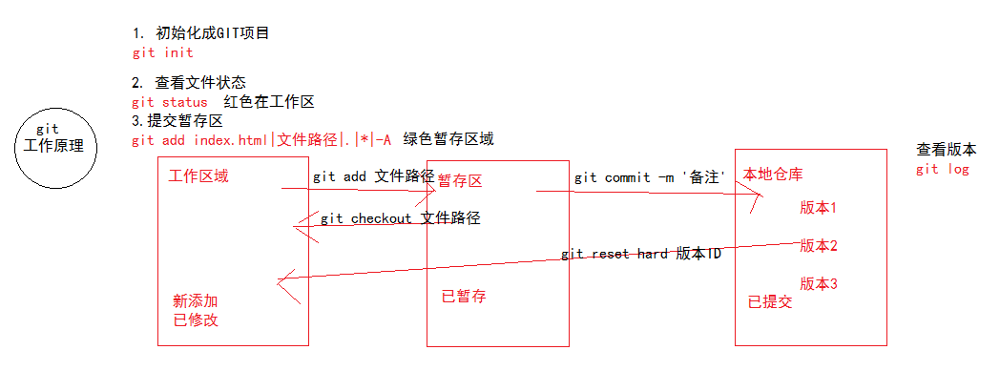
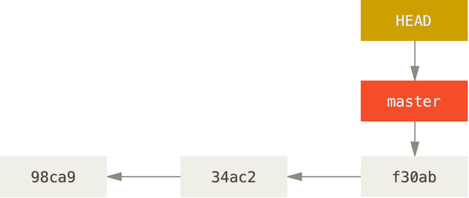
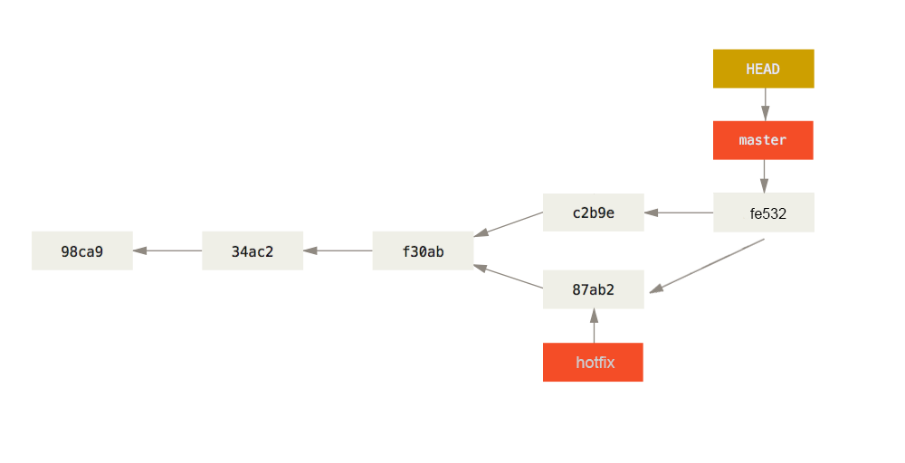
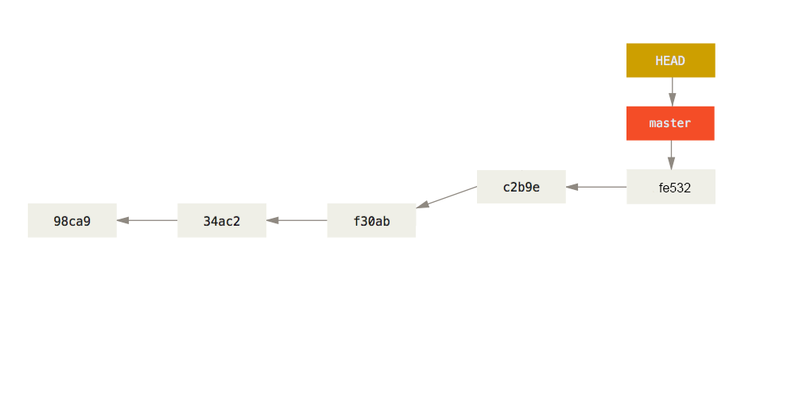

# GIT 分布式版本控制工具
### 1.学习地址
> 1.git中文文档地址：https://git-scm.com/book/zh/v2

### 2.版本控制系统分类
#### 2.1.本地版本控制系统
许多人习惯用复制整个项目目录的方式来保存不同的版本，或许还会改名加上备份时间以示区别。 这么做唯一的好处就是简单，但是特别容易犯错。 有时候会混淆所在的工作目录，一不小心会写错文件或者覆盖意想外的文件。为了解决这个问题，人们很久以前就开发了许多种本地版本控制系统，大多都是采用某种简单的数据库来记录文件的历次更新差异。


#### 2.2.集中化的版本控制系统
集中化版本控制系统（Centralized Version Control Systems，简称 CVCS），单一的集中管理的服务器，保存所有文件的修订版本，而协同工作的人们都通过客户端连到这台服务器，取出最新的文件或者提交更新。管理员可以轻松掌控每个开发者的权限，并且管理一个 CVCS 要远比在各个客户端上维护本地数据库来得轻松容易。缺点是中央服务器的单点故障。


#### 2.3.分布式版本控制系统
分布式版本控制系统（Distributed Version Control System，简称 DVCS），客户端并不只提取最新版本的文件快照，而是把代码仓库完整地镜像下来。


### 3.GIT 基础
#### 3.1.GIT安装
> windows https://gitforwindows.org/

#### 3.2.GIT原理
> 与其他版本控制工具的区别如图：

概念上来区分，其它大部分系统以文件变更列表的方式存储信息。 这类系统（CVS、Subversion、Perforce、Bazaar 等等）将它们保存的信息看作是一组基本文件和每个文件随时间逐步累积的差异。


Git 像是把数据看作是对小型文件系统的一组快照。 每次你提交更新，或在 Git 中保存项目状态时，它主要对当时的全部文件制作一个快照并保存这个快照的索引。 为了高效，如果文件没有修改，Git 不再重新存储该文件，而是只保留一个链接指向之前存储的文件。 Git 对待数据更像是一个 快照流。这是 Git 与几乎所有其它版本控制系统的重要区别。


Git 有三种状态，你的文件可能处于其中之一：已提交（committed）、已修改（modified）和已暂存（staged）。


1. 在工作目录中修改文件。
2. 暂存文件，将文件的快照放入暂存区域。
3. 提交文件，找到暂存区域的文件，将快照永久性存储到Git仓库目录。  

####  3.3.GIT常见操作
##### 1.配置用户
```
git config --global user.name "dangfeixiong"
git config --global user.email "dangfeixiong@58ganji.com"
```
##### 2.初始化仓库
```
// 初始化本地仓库（生成.git目录）
git init
// 将远程项目克隆到本地
git clone https://github.com/dangfx/GrowthNotes.git growth_notes
```
##### 3.查看文件状态
```
git status	// 注:git会忽略空目录
```
##### 4.添加文件到暂存区
```
git add test.txt	// 提交单个文件
git add css	// 提交单个目录文件
git add .|*|-A	// 提交所有文件
git checkout test.txt	// 撤销已经add的文件
```
##### 5.提交文件
```
git commit -m 'message'		//message 提交的备注信息
```
##### 6.查看提交历史
```
git log			// 查看所有变更
git relog		// 查看之前操作
```
##### 7.恢复某次提交
```
git reset --hard 243w
```
git 常见操作与状态转换描述，工作区<==>暂存区<==>本地仓库，三种状态切换。


### 4.  GIT 分支
#### 4.1 分支第一次提交
在Git的使用过程中一次提交称为历史记录（版本），并且会生成一个唯一的字符串

```
git commit -m 'message'
```

#### 4.2 创建分支
只是为你创建了一个可以移动的新的指针。 比如，创建一个 testing 分支

```
git branch testing
```

#### 4.3 切换分支
切换到新创建的 testing 分支，起始就是移动HEAD头指针到testing分支。

```
git checkout testing
```

#### 4.4 修改testing分支
修改当前分支文件内容，提交当前（testing）分支，同时移动HEAD头指针。

```
git add testing.txt
git commit -m 'message'
```

#### 4.5 切换分支
从testing分支求换到master分支，只是移动HEAD指针到master分支上。

```
git checkout master
```

#### 4.6  修改master分支
修改当前分支文件内容，提交当前（master）分支，同时移动HEAD头指针。

```
git add master.txt
git commit -m 'message'
```

#### 4.7 合并分支
切换到master分支，将testing分支修改合并到master分支上

```
git merge testing
```

#### 4.8 删除分支


```
git branch -d testing
```

### 5. 远程共享仓库
#### 1. 常用的GIT仓库服务器软件GitLab
```
// git global setup
git config --global user.name "dangfeixiong"
git config --global user.email "dangfeixiong@123.com"

// create a new respository
git clone https://github.com/dangfx/GrowthNotes.git growth_notes
cd hello
touch README.md
git add .
git commit -m 'add README.md'
git push -u origin master	//加了参数-u后，以后直接用git push 代替git push origin master

// existing folder
cd existing_folder
git init
git remote add origin https://github.com/dangfx/GrowthNotes.git	//连接远程github项目
git add .
git commit -m 'initial commit'
git push -u origin master

// existing git repository
cd existing_repo
git remote add porigin https://github.com/dangfx/GrowthNotes.git
git push -u origin --all	//将所有本地分支都推送到origin主机
git push -u origin --tags	//git push不会推送标签(tag)，除非使用–tags选项
```
#### 2. 第三方共享GIT服务器GitHub免密配置
```
// 生成公钥/私钥 "dangfeixiong@123.com"是Github帐号
ssh-keygen -t rsa -C "dangfeixiong@123.com"

// 查看公钥/私钥
C:\Users\Administrator\.ssh

// GitHub设置ssh
点击右上角账号头像的“▼”→Settings→SSH and GPG keys →New SSH key
复制id_rsa.pub的公钥内容。添加到Key 中，Titile可以随便填写。最后 Add SSH Key。

// 测试ssh
ssh -T git@github.com
```