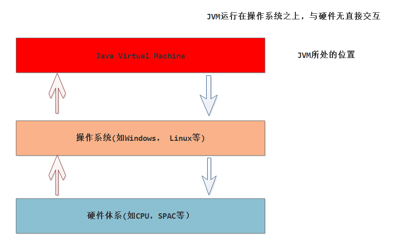
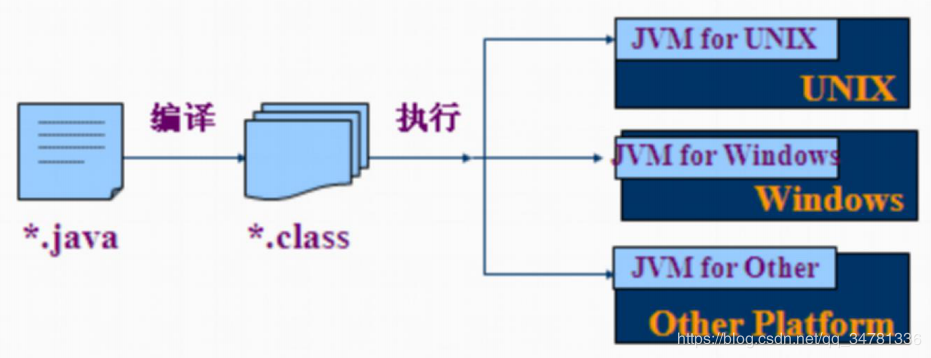
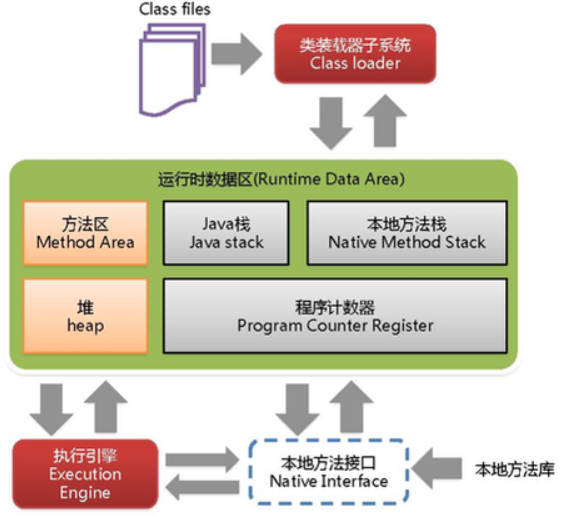
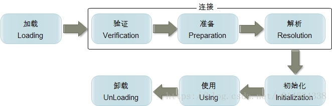
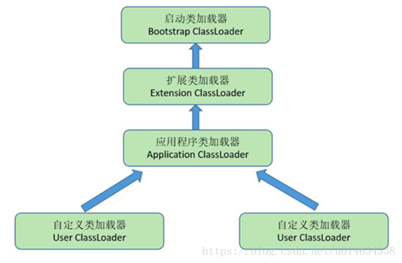
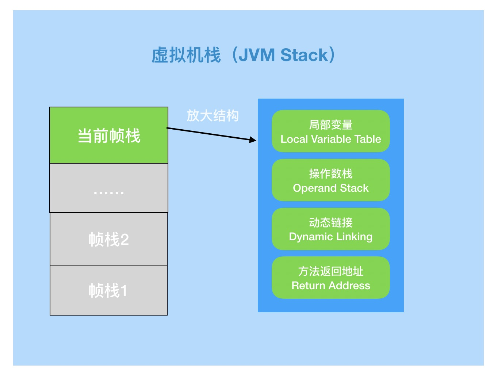
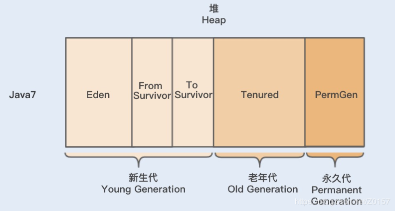
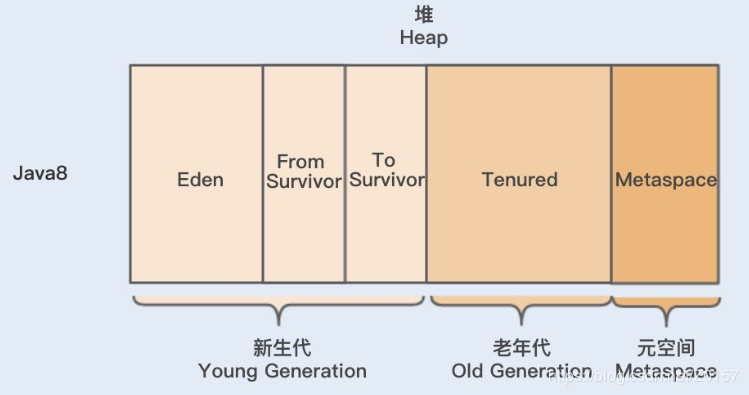
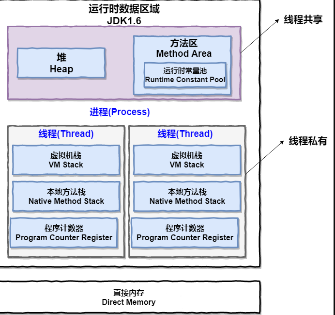
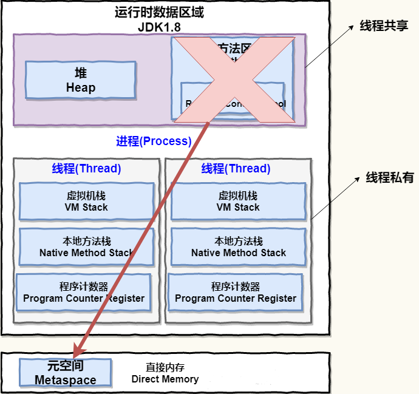

### 1.JVM所处位置

>JVM ：Java Virtual Machine（Java虚拟机）。
>
>JVM运行在操作系统之上，与硬件无直接交互。



>Java语言是跨平台运行的（操作系统，使用不同的JVM映射规则，让其与操作系统无关）
>
>JVM并不具有跨平台性（JVM是编译后的机器码）



### 2.JVM体系架构

>JVM体系结构：上中下3层
>
>上：ClassLoader
>
>中：Runtime Data area
>
>下：Execution Engine，Native Interface



### 3.ClassLoader
> ClassLoader：（类加载器）加载 `class` 文件进内存，对数据验证，转换解析，初始化，生成JVM可以使用Java类型。



>ClassLoader分类：

| 别称           | 名称                 | 实现语言 | 加载范围                            |
| -------------- | -------------------- | -------- | ----------------------------------- |
| 根加载器       | BootstrapClassLoader | C++      | JAVA_HOME/jre/lib/rt.jar            |
| 扩展类加载器   | ExtClassLoader       | Java     | JAVA_HOME/jre/lib/ext/*.jar         |
| 系统类加载器   | AppClassLoader       | Java     | classpath目录下的所有jar和class文件 |
| 自定义类加载器 | User ClassLoader     | Java     | 文件系统/网络URL...                 |

> ClassLoader： 双亲委派，沙箱安全
>
> 双亲委派：由上至下依次检查的，首先由最顶层的类加载器Bootstrap ClassLoader试图加载，如果没加载到，则把任务转交给Extension ClassLoader试图加载，如果也没加载到，则转交给App ClassLoader 进行加载，如果它也没有加载得到的话，则返回给委托的发起者，由它到指定的文件系统或网络等URL中加载该类。如果它们都没有加载到这个类时，则抛出ClassNotFoundException异常。否则将这个找到的类生成一个类的定义，并将它加载到内存当中，最后返回这个类在内存中的Class实例对象。
>
> 由双亲委派来保证沙箱安全，确保JVM自带Class不被修改。



> 理解双亲委派，可以查看ClassLoader.loadClass方法:

```java
protected Class<?> loadClass(String name, boolean resolve) throws ClassNotFoundException {
    synchronized (getClassLoadingLock(name)) {
        // 检查是否已经加载过
        Class<?> c = findLoadedClass(name);
        if (c == null) { // 没有被加载过
            long t0 = System.nanoTime();
            // 先委派给父类加载器加载
            try {
                if (parent != null) {
                    c = parent.loadClass(name, false);
                } else {
                    //如果父加载器不存在，则委托给启动类加载器 加载
                    c = findBootstrapClassOrNull(name);
                }
            } catch (ClassNotFoundException e) {
                // ClassNotFoundException thrown if class not found
                // from the non-null parent class loader
            }

            if (c == null) {
                // 如果父类加载器无法加载，自身才尝试加载
                long t1 = System.nanoTime();
                c = findClass(name);

                // this is the defining class loader; record the stats
                sun.misc.PerfCounter.getParentDelegationTime().addTime(t1 - t0);
                sun.misc.PerfCounter.getFindClassTime().addElapsedTimeFrom(t1);
                sun.misc.PerfCounter.getFindClasses().increment();
            }
        }
        if (resolve) {
            resolveClass(c);
        }
        return c;
    }
}
```

> User ClassLoader 使用

```java
// 创建被加载的类
public class HelloWorld {
    static {
        System.out.println("User ClassLoader Test...");
    }
}

// 创建类加载器
package com.dangfx.thread;

import java.io.ByteArrayOutputStream;
import java.io.File;
import java.io.FileInputStream;

public class UserClassLoader extends ClassLoader {

    private String classPath;

    public UserClassLoader(String classPath) {
        this.classPath = classPath;
    }

    @Override
    protected Class<?> findClass(String name) {
        String fullPath = this.getPath(name);
        try {
            FileInputStream in = new FileInputStream(fullPath);
            ByteArrayOutputStream out = new ByteArrayOutputStream();
            int i = 0;
            while ((i = in.read()) != -1) {
                out.write(i);
            }
            byte[] byteArray = out.toByteArray();
            // 实例化 class
            return defineClass(name, byteArray, 0, byteArray.length);
        } catch (Exception e) {
            e.printStackTrace();
        }
        return null;
    }

    private String getPath(String className) {
        return this.classPath.concat(className.replace(".", File.separator)).concat(".class") ;
    }
}

// 使用自定义类加载器，加载定义的类
@Test
public void UserClassLoader() throws Exception {
    String classPath = "D:\\";
    UserClassLoader userClassLoader = new UserClassLoader(classPath);
    Class<?> loaderClass = userClassLoader.loadClass("HelloWorld");
    System.out.println("classLoader:" + loaderClass.getClassLoader());
    Object instance = loaderClass.newInstance();
    System.out.println(instance);
}

// 执行结果
classLoader:com.dangfx.thread.UserClassLoader@2b2948e2
User ClassLoader Test...
HelloWorld@3b0143d3
```

### 4.程序计数器

>1. 记录当前线程执行地址（记录的是正在执行字节码指令的地址）。
>2. 程序计数器，是唯一一个在java虚拟机规范中没有规定任何OutOfMemoryError的区域。
>3. 执行native本地方法时，程序计数器的值为空（Undefined），C/C++执行时的内存分配是由自己语言决定的，而不是由JVM决定的。
>4. 程序计数器占用内存很小，在进行JVM内存计算时，可以忽略不计。

### 5.native method stack

>1. 定义 `native method` ，只有方法定义没有方法实现，类似 `interface` ，现体是由非java语言实现的。
>2. `JNI`  Java Native Interface，它提供了若干的API实现了Java和其他语言的通信，JNI允许Java代码使用以其他语言编写的代码和代码库。
>3. 通过 `RPC` 实现异构平台（不同语言）交互问题。

### 6.java stack

>栈帧(Stack Frame)：每个方法在执行时都会创建一个栈帧
>
>线程栈：(JMM) 执行java方法，创建栈帧[局部变量表，操作数栈，动态链接，方法出口]
>
>局部变量表：方法参数，局部变量；存放了编译期可知的各种基本类型(boolean、byte、char、short、int、float、long、double)、对象引用(reference 类型)和 returnAddress 类型(指向了一条字节码指令的地址)。
>
>操作数栈：【LIFI】的执行引擎
>
>动态链接：【静态标识】代码执行指向静态标识指令码地址
>
>方法出口：调用方法对应的行标识
>
>`引用标识(reference) ==> heap(对象实例数据) ==> metnod area(对象数据类型)`



### 7.heap

>java7：young（新生代），old（老年代），permanent（永久代）
>
>young：eden，s0，s1



> java8：young（新生代），old（老年代），metaSpace（元空间，物理内存）
>
> young：eden，s0，s1



### 8.method area

> class结构信息（字节码文件），类信息，常量，静态变量。

### 9.JDK8以前 & JDK8

>JDK8以前



>JDK8

