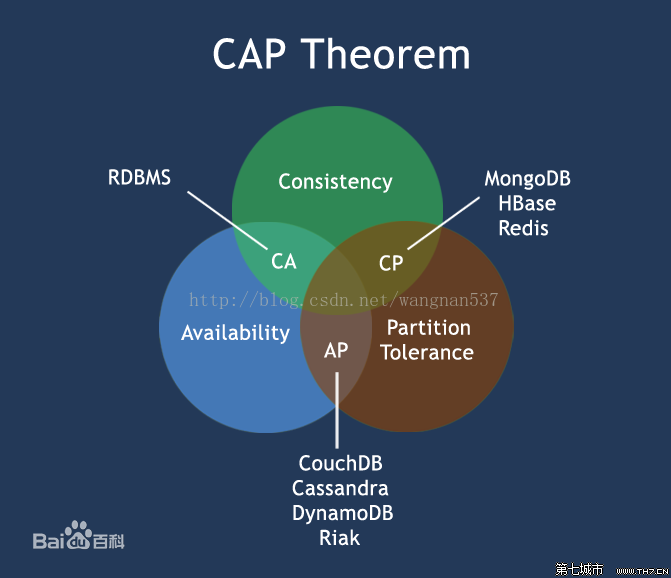

# Mongodb 学习

### 1.linux安装 mongo

> 官网地址：https://www.mongodb.com/download-center/community
>
> 安装版本下载：https://fastdl.mongodb.org/linux/mongodb-linux-x86_64-3.4.19.tgz

```powershell
# 创建目录
mkdir /usr/local/soft
cd /usr/local/soft
# 下载安装包
wget https://fastdl.mongodb.org/linux/mongodb-linux-x86_64-3.4.19.tgz
# 解压
tar -zxvf mongodb-linux-x86_64-3.4.19.tgz
# 移动文件夹
mv /usr/local/soft/mongodb-linux-x86_64-3.4.19 /usr/local/mongodb-3.4.19
# 创建文件夹及文件
cd /usr/local/mongodb-3.4.19
mkdir -p base/data/db base/data/logs
touch /usr/local/mongodb-3.4.19/base/data/logs/mongodb.log
touch /usr/local/mongodb-3.4.19/base/mongodb.conf
```

> mongodb.conf 文件内容如下:

```
#端口号
port = 27017
#数据目录
dbpath = /usr/local/mongodb-3.4.19/base/data/db
#日志目录
logpath = /usr/local/mongodb-3.4.19/base/data/logs/mongodb.log
#设置后台运行
fork = true
#日志输出方式
logappend = true
#开启认证
auth = true
```

> 启动 mongodb 服务

````powershell
cd /usr/local/mongodb-3.4.19/bin
./mongod -f /usr/local/mongodb-3.4.19/base/mongodb.conf
./mongo 127.0.0.1:27017
````

> `auth = true`开启认证模式，创建用户

```javascript
use admin
db.createUser(
  {
    user: "admin",
    pwd: "admin",
    roles: [ { role: "root", db: "admin" } ]
  }
);
```

### 2.mongodb概念

> NoSQL是对不同于传统的关系数据库的数据库管理系统的统称。
>
> 两者存在许多显著的不同点，其中最重要的是NoSQL不使用SQL作为查询语言。其数据存储可以不需要固定的表格模式，也经常会避免使用SQL的JOIN操作，一般有水平可扩展性的特征。
>
> mongodb概念解析

| SQL术语     | mongodb术语 | 说明    |
| ----------- | ----------- | ------- |
| database    | database    | 数据库  |
| table       | collection  | 表/集合 |
| row         | document    | 行/文档 |
| column      | field       | 列/字段 |
| index       | index       | 索引    |
| primary key | primary key | 主键    |
| table join  |             | 表连接  |

> 举例说明


> mongodb 特点


> mongodb 数据存储格式


### 3. mongodb 基本操作[CRUD]

```javascript
# 查看数据库
show dbs;
# 进入数据库
use 数据库名;
# 删除数据库
db.dropDatabase();
# 创建集合
db.createCollection("users");
# 创建集合及文档
db.users.insert({user_id: "abc123", age: 55, status: "A" });
# 删除文档
db.users.remove({"user_id":"abc123"});
# 更新文档
# db.collection.update( criteria, objNew, upsert, multi )
# criteria : update的查询条件，类似sql update查询内where后面的
# objNew   : update的对象和一些更新的操作符（如$,$inc...）
# upsert   : 如果不存在update的记录，是否插入objNew,true为插入，默认是false，不插入。
# multi    : mongodb默认是false,只更新找到的第一条记录，如果这个参数为true,全部更新。
db.users.update({"user_id":"abc123"},{$set:{"age":23}},0,1);
# 替换文档
db.users.update({"user_id":"abc123"},{"age":24},0,1);
# 删除某个字段
db.users.update({"user_id":"abc123"},{$unset:{"address":1},0,1});
# 删除集合
db.users.drop();
# 查看集合中文档
show collections;
# 查看文档内容 [条件 显示列]
db.users.find({"user_id":"abc123"},{"user_id":1, "age":1});
# 查看数量
db.users.count();
db.users.find({}).count();
# 查询结果去重
db.users.distinct("name");
# 模糊查询 user_id以abc开头
db.users.find({"user_id":/^abc/});
# and 操作
db.users.find({"name":"u5",age:{$gt:33}});
db.users.find({$and:[{"name":"u5"},{age:{$gt:33}}]});
# or 操作
db.users.find({$or:[{"name":"u5"},{age:{$gt:33}}]});
# not 操作
db.users.find({age:{$not:{$lt:35}}});
db.users.find({name:{$not:/wang/}});
# in/not in 操作
db.users.find({age:{$in:[33,35]}});
db.users.find({age:{$nin:[33,35]}});
# 配置数组操作
db.users.find({score:{$all:[7,4]}}); 元素的顺序无所谓
# 查询数组长度
db.users.find({"score":{$size:4}});
# 数组中添加元素
db.users.update({"user_id":"abc123"},{"$push":{"score":2}},0,1); 一个
db.users.update({"user_id":"abc123"},{"$push":{"score":{"$each":[1,2,3]}},0,1); 多个
# 指定查询数组特定位置
db.users.find({"score.0":7});  索引从0开始
db.users.find({"score.$":7});  任意一个数组元素
# null 操作 不仅能匹配键的值为null,还匹配键不存在的情况
db.users.find({score:null});
db.users.find({name:{$in:[null],$exists:1}});
# 某个键是否存在
db.users.find({"score":{$exists:1}});
# 排序/分页查询
db.users.find().sort({"age":1,"name":-1}).limit(2);
db.users.find().skip(2).limit(2);
# 内嵌文档
db.users.update({"name":"u2"},{$set:{wendang:{"yw":80,"xw":90}}});
db.users.find({"wendang.yw":80});
```

### 4.mongodb集群搭建之Replica-Set方式

>副本集的方式需要一个主节点，一个备节点，如果主节点发生故障，那么会启用备节点，当主节点修复之后，主节点再次恢复为主节点，备节点不再是主节点的角色。副本集的方式还需要一个角色，那就是仲裁节点，它不存储数据，他的作用就是当主节点出现故障，选举出备节点作为主节点，继续保证集群可用。客户端连接时只连接主节点或者备节点，不用连接仲裁节点。

#### 3.1 原理如图


#### 3.2 修改配置文件

```powershell
cd /usr/local/mongodb-3.4.19
# 复制新建目录
cp -r base/ master/
cp -r base/ slave/
cp -r base/ arbiter/
# 修改目录中的mongodb.conf文件
```

> 修改 master(primary节点) 文件中 mongodb.conf

```powershell
dbpath=/usr/local/mongodb-3.4.19/master/data/db
logpath=/usr/local/mongodb-3.4.19/master/data/logs/mongodb.log
pidfilepath=/usr/local/mongodb-3.4.19/master.pid
directoryperdb=true
logappend=true
replSet=testrs
bind_ip=192.168.114.129
port=20001
oplogSize=10000
fork=true
noprealloc=true
```

> 修改 slave(secondary节点) 文件中 mongodb.conf

```powershell
dbpath=/usr/local/mongodb-3.4.19/slave/data/db
logpath=/usr/local/mongodb-3.4.19/slave/data/logs/mongodb.log
pidfilepath=/usr/local/mongodb-3.4.19/slave.pid
directoryperdb=true
logappend=true
replSet=testrs
bind_ip=192.168.114.129
port=20002
oplogSize=10000
fork=true
noprealloc=true
```

> 修改 arbiter(仲裁节点) 文件中 mongodb.conf

```
dbpath=/usr/local/mongodb-3.4.19/arbiter/data/db
logpath=/usr/local/mongodb-3.4.19/arbiter/data/logs/mongodb.log
pidfilepath=/usr/local/mongodb-3.4.19/arbiter.pid
directoryperdb=true
logappend=true
replSet=testrs
bind_ip=192.168.114.129
port=20003
oplogSize=10000
fork=true
noprealloc=true
```

> 启动上述3个实例

```powershell
cd /usr/local/mongodb-3.4.19/bin
./mongod -f /usr/local/mongodb-3.4.19/master/mongodb.conf
./mongod -f /usr/local/mongodb-3.4.19/slave/mongodb.conf
./mongod -f /usr/local/mongodb-3.4.19/arbiter/mongodb.conf
```

> 连接 master 实例

```powershell
cd /usr/local/mongodb-3.4.19/bin
./mongo 192.168.114.129:20001
```

> 集群配置

```powershell
# 切换数据库
use admin
# priority:2 最大的是主节点
cfg={_id:"testrs",members:[
{_id:0,host:"192.168.114.129:20001",priority:2},{_id:1,host:"192.168.114.129:20002",priority:1},{_id:2,host:"192.168.114.129:20003",arbiterOnly:true}]};
# 初始化配置集群
rs.initiate(cfg)
# 查看集群状态
rs.status()
```

> 从节点 `not master and slaveOk=false` 问题处理

```powershell
rs.slaveOk()
```

> 测试集群

```powershell
ps -ef |grep mongod
kill -9 进程号
# 查看集群状态 [主节点:"not reachable/healthy"，从节点:"PRIMARY"]
rs.status()
```

注: mongodb是cp类型的分布式系统

CAP原则又称CAP定理，指的是在一个分布式系统中，Consistency（一致性）、 Availability（可用性）、Partition tolerance（分区容错性），三者不可兼得。

