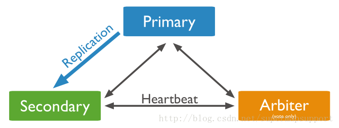

# Mongodb 学习

### 1.linux安装 mongo

> 官网地址：https://www.mongodb.com/download-center/community
>
> 安装版本下载：https://fastdl.mongodb.org/linux/mongodb-linux-x86_64-3.4.19.tgz

```powershell
# 创建目录
mkdir /usr/local/soft
cd /usr/local/soft
# 下载安装包
wget https://fastdl.mongodb.org/linux/mongodb-linux-x86_64-3.4.19.tgz
# 解压
tar -zxvf mongodb-linux-x86_64-3.4.19.tgz
# 移动文件夹
mv /usr/local/soft/mongodb-linux-x86_64-3.4.19 /usr/local/mongodb-3.4.19
# 创建文件夹及文件
cd /usr/local/mongodb-3.4.19
mkdir -p base/data/db base/data/logs
touch /usr/local/mongodb-3.4.19/base/data/logs/mongodb.log
touch /usr/local/mongodb-3.4.19/base/mongodb.conf
```

> mongodb.conf 文件内容如下:

```
#端口号
port = 27017
#数据目录
dbpath = /usr/local/mongodb-3.4.19/base/data/db
#日志目录
logpath = /usr/local/mongodb-3.4.19/base/data/logs/mongodb.log
#设置后台运行
fork = true
#日志输出方式
logappend = true
#开启认证
auth = true
```

> 启动 mongodb 服务

````powershell
cd /usr/local/mongodb-3.4.19/bin
./mongod -f /usr/local/mongodb-3.4.19/base/mongodb.conf
./mongo 127.0.0.1:27017
````

> `auth = true`开启认证模式，创建用户

```javascript
use admin
db.createUser(
  {
    user: "admin",
    pwd: "admin",
    roles: [ { role: "root", db: "admin" } ]
  }
);
```

### 2.mongodb集群搭建之Replica-Set方式

>副本集的方式需要一个主节点，一个备节点，如果主节点发生故障，那么会启用备节点，当主节点修复之后，主节点再次恢复为主节点，备节点不再是主节点的角色。副本集的方式还需要一个角色，那就是仲裁节点，它不存储数据，他的作用就是当主节点出现故障，选举出备节点作为主节点，继续保证集群可用。客户端连接时只连接主节点或者备节点，不用连接仲裁节点。

#### 2.1 原理如图



#### 2.2 修改配置文件

```powershell
cd /usr/local/mongodb-3.4.19
# 复制新建目录
cp -r base/ master/
cp -r base/ slave/
cp -r base/ arbiter/
# 修改目录中的mongodb.conf文件
```

> 修改 master(primary节点) 文件中 mongodb.conf

```powershell
dbpath=/usr/local/mongodb-3.4.19/master/data/db
logpath=/usr/local/mongodb-3.4.19/master/data/logs/mongodb.log
pidfilepath=/usr/local/mongodb-3.4.19/master.pid
directoryperdb=true
logappend=true
replSet=testrs
bind_ip=192.168.114.129
port=20001
oplogSize=10000
fork=true
noprealloc=true
```

> 修改 slave(secondary节点) 文件中 mongodb.conf

```powershell
dbpath=/usr/local/mongodb-3.4.19/slave/data/db
logpath=/usr/local/mongodb-3.4.19/slave/data/logs/mongodb.log
pidfilepath=/usr/local/mongodb-3.4.19/slave.pid
directoryperdb=true
logappend=true
replSet=testrs
bind_ip=192.168.114.129
port=20002
oplogSize=10000
fork=true
noprealloc=true
```

> 修改 arbiter(仲裁节点) 文件中 mongodb.conf

```
dbpath=/usr/local/mongodb-3.4.19/arbiter/data/db
logpath=/usr/local/mongodb-3.4.19/arbiter/data/logs/mongodb.log
pidfilepath=/usr/local/mongodb-3.4.19/arbiter.pid
directoryperdb=true
logappend=true
replSet=testrs
bind_ip=192.168.114.129
port=20003
oplogSize=10000
fork=true
noprealloc=true
```

> 启动上述3个实例

```powershell
cd /usr/local/mongodb-3.4.19/bin
./mongod -f /usr/local/mongodb-3.4.19/master/mongodb.conf
./mongod -f /usr/local/mongodb-3.4.19/slave/mongodb.conf
./mongod -f /usr/local/mongodb-3.4.19/arbiter/mongodb.conf
```

> 连接 master 实例

```powershell
cd /usr/local/mongodb-3.4.19/bin
./mongo 192.168.114.129:20001
```

> 集群配置

```powershell
# 切换数据库
use admin
# priority:2 最大的是主节点
cfg={_id:"testrs",members:[
{_id:0,host:"192.168.114.129:20001",priority:2},{_id:1,host:"192.168.114.129:20002",priority:1},{_id:2,host:"192.168.114.129:20003",arbiterOnly:true}]};
# 初始化配置集群
rs.initiate(cfg)
# 查看集群状态
rs.status()
```

> 从节点 `not master and slaveOk=false` 问题处理

```powershell
rs.slaveOk()
```

> 测试集群

```powershell
ps -ef |grep mongod
kill -9 进程号
# 查看集群状态 [主节点:"not reachable/healthy"，从节点:"PRIMARY"]
rs.status()
```

注: mongodb是cp类型的分布式系统

CAP原则又称CAP定理，指的是在一个分布式系统中，Consistency（一致性）、 Availability（可用性）、Partition tolerance（分区容错性），三者不可兼得。

