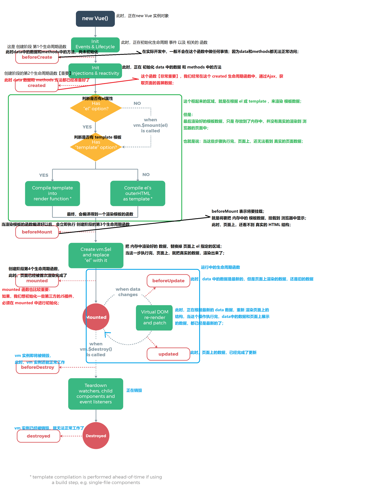

###  Vue基础
#### 1. 库与框架的区别
1. 概念：框架大而全，库小而巧。
2. 框架：是一套完整的解决方案，对项目的入侵性大，如果对项目调整框架，需要重新架构整个项目。
3. 库：提供某个小功能，对项目的入侵性小，如果某个库不能满足要求，很容易切换到其他合适的库

#### 2. Vue是什么
1. Vue是目前最火的前端框架，学习起来很容易，文档很友好；
2. Vue是一套构建用户界面的框架，只关注视图层（页面）的开发；
3. 前端流行框架的诞生，避免程序员手动操作DOM元素（DOM驱动转换为数据驱动）；
#### 3. MVC与MVVM的区别
+ MVC是后端分层开发思想，主要分为三层：
   + Model:（数据层）负责数据库的操作
   + View：（视图层）负责前端页面操作
   + Controller：（业务逻辑层）负责相关业务逻辑处理
+ MVVM是前端分层开发思想，主要分为三层：
  + Model：页面中所用到的数据
  + View：页面中的HTML结构+
  + ModelView：是Model与View中间的调度着，引出了双向数据绑定
+ MVVM把页面分成三部分，同时VM作为MVVM的核心，提供了双向数据绑定，前端程序员只关心页面校核逻辑，不用关心页面渲染；
+ Vue的执行逻辑
   + 当 VM 实例对象被创建完成之后，会立即解析 el 指定区域中的所有代码；
   + 当 VM 在解析 el 区域中所有代码的时候，会把 data 中的数据按需填充到页面指定的区域；
   + 当 VM 实例对象，监听到 data 中数据发生了变化，就会立即重新解析执行 el 区域内所有代码；


#### 4. Vue基本指令

> 1. 插值表达式 `{{}}`；插值表达式中 使用简单的表达式，不能写语句；插值表达式只能用在元素的内容区域；不能用在元素的属性节点中；

```html
<p>{{msg}}</p>
```

> 2.Vue指令 `v-text`
> `v-text` 与 `{{}}` 区别，内容是否覆盖，插值表达式闪烁问题

```html
<p v-text="msg">data</p>	<!-- data被覆盖 -->
```

>3.Vue指令 `v-html`；msg中如果有html标签时可以被浏览器解析，有js脚本注入风险

```html
<p v-html="msg"></p>	<!-- msg:<span>data</span> -->
```

>4.Vue指令 `v-bind`；是为html属性节点动态绑定数据；v-bind:` 可以简写为 `:`

```html
<button v-bind:title="msg">按钮</button>
<button :title="msg">按钮</button>
<!-- class样式使用 -->
<p :class="['thin', 'red', 'big']">data</p>
<p :class="['thin', flag ? 'red' : '']">data</p>
```

>5.Vue指令 `v-model`；`v-model` 只能与表单元素配合使用；`v-bind` 实现单项数据同步 `data ---> 页面` ；`v-model` 实现上香数据同步 `data <---> 页面`

```html
<input type="text" v-model="msg" />
```

>6.Vue指令 `v-on:`；为html元素绑定时间函数；`v-on:` 简写为 `@`

```html
<input type="button" value="按钮" v-on:click="事件处理函数"/>
<input type="button" value="按钮" v-on:click="show(123)"/>
<input type="button" value="按钮" @click="show(123)"/>
```

>7.Vue指令 `v-show`  `v-if`；切换页面元素的显示与隐藏；`v-if` 有更高的切换消耗，`v-show`  是通过 display:none 来切换状态

```html
{{if true}}
	<div>data</div>
{{/if}}
<div v-if="true">data1</div>
<div v-show="true">data2</div>
```

>8.Vue指令 `v-for`；迭代数组，迭代对象元素；给 Vue 一个提示，以便能跟踪每个节点的身份，从而重用和重新排序现有元素，为每项提供一个唯一 key 。

```html
<!-- 数组 -->
<li v-for="(item, index) in items" :key="item.id">
    {{ parentMessage }} - {{ index }} - {{ item.message }}
</li>

data: {
	parentMessage: 'Parent',
    items: [{ id: 1, message: 'Foo' }, { id:2, message: 'Bar' }]
  }
```

```html
<!-- 对象 -->
<div v-for="(value, key, index) in object">
  {{ index }}. {{ key }}: {{ value }}
</div>

data: {
    object: {firstName: 'John', lastName: 'Doe', age: 30}
 }
```
#### 5. 修饰符
##### 1. 事件修饰符

```html
<!-- 阻止单击事件继续传播 -->
<a v-on:click.stop="doThis"></a>

<!-- 提交事件不再重载页面 -->
<form v-on:submit.prevent="onSubmit"></form>

<!-- 修饰符可以串联 -->
<a v-on:click.stop.prevent="doThat"></a>

<!-- 只有修饰符 -->
<form v-on:submit.prevent></form>

<!-- 添加事件监听器时使用事件捕获模式 -->
<!-- 即元素自身触发的事件先在此处理，然后才交由内部元素进行处理 -->
<div v-on:click.capture="doThis">...</div>

<!-- 只当在 event.target 是当前元素自身时触发处理函数 -->
<!-- 即事件不是从内部元素触发的 -->
<div v-on:click.self="doThat">...</div>

<!-- 点击事件将只会触发一次 -->
<a v-on:click.once="doThis"></a>
```

##### 2. 按键修饰符

+ `.enter`
+ `.tab`
+ `.delete`  ('删除'与'退格')
+ `.esc`
+ `.space`
+ `.up`
+ `.down`
+ `.left`
+ `.right` 

```html
<!-- 只有在 `keyCode` 是 13 时调用 `vm.submit()` -->
<input v-on:keyup.13="submit">
<input v-on:keyup.enter="submit">
<input @keyup.enter="submit">
```
#### 6. 过滤器
##### 1. 全局过滤器

```html
<span>{{ dt | 过滤器的名称('arg1', 'arg2') }}</span>

Vue.filter('过滤器的名称', function(originVal, arg1, arg2){ /* 对数据进行处理的过程，在这个 function 中，最后必须 return 一个处理的结果 */ })
```

##### 2. 私有过滤器

```html
<span>{{ dt | 过滤器的名称('arg1', 'arg2') }}</span>

filters: {
  过滤器的名称: function (originVal, arg1, arg2) {
    /* 对数据进行处理的过程，在这个 function 中，最后必须 return 一个处理的结果 */
  }
}
```

#### 7.Vue生命周期



- **创建期间**的生命周期函数：(特点：每个实例一辈子只执行一次)
   + beforeCreate：创建之前，此时 data 和 methods 尚未初始化
   + **created**(第一个重要的函数，此时，data 和 methods 已经创建好了，可以被访问了)
   + beforeMount：挂载模板结构之前，此时，页面还没有被渲染到浏览器中；
   + **mounted**（第二个重要的函数，此时，页面刚被渲染出来；如果要操作DOM元素，最好在这个阶段）
 - **运行期间**的生命周期函数：（特点：按需被调用 至少0次，最多N次）
   + beforeUpdate：数据是最新的，页面是旧的
   + updated：页面和数据都是最新的
 - **销毁期间**的生命周期函数：(特点：每个实例一辈子只执行一次)
   + beforeDestroy：销毁之前，实例还正常可用
   + destroyed：销毁之后，实例已经不工作了

####  8.Vue阶段示例

```html
<!DOCTYPE html>
<html lang="en">
<head>
    <meta charset="UTF-8">
    <title>menu</title>
    <!-- 依赖lib包，使用CDN:https://www.jsdelivr.com -->
    <script src="https://cdn.jsdelivr.net/npm/vue@2.6.10/dist/vue.js"></script>
    <script src="https://cdn.jsdelivr.net/npm/vue-resource@1.2.0/dist/vue-resource.js"></script>
    <link href="https://cdn.jsdelivr.net/npm/bootstrap@3.3.7/dist/css/bootstrap.min.css" rel="stylesheet">
</head>

<body>
    <div id="app">

        <div class="panel panel-primary">
            <div class="panel-heading">
                <h3 class="panel-title">商品CRUD操作</h3>
            </div>
            <div class="panel-body form-inline">
                <label>bid: <input type="text" name="bid" class="form-control" v-model="bid"></label>
                <label>bookname:<input type="text" name="bookname" class="form-control" v-model="bookname"></label>
                <label>book_cover:<input type="text" name="book_cover" class="form-control"
                        v-model="book_cover"></label>
                <input type="button" value="add" class="btn btn-primary" @click="add">
                <span>{{ book_data }}</span>
                <label>search:
                    <input type="text" class="form-control" placeholder="search" v-model="keywords" v-focus v-color>
                </label>
            </div>

            <table class="table table-striped table-bordered">
                <thead>
                    <tr>
                        <td>bid</td>
                        <td>bookname</td>
                        <td>book_cover</td>
                        <td>operate</td>
                    </tr>
                </thead>
                <tbody>
                    <tr v-for="item in search(keywords)" :key="item.bid">
                        <td v-text="item.bid"></td>
                        <td v-text="item.bookname"></td>
                        <td></td>
                        <!-- <td>{{ item.time | date_format('yyyy-mm-dd hh:MM:ss') }}</td> -->
                        <td>
                            <input type="button" value="del" class="btn btn-primary btn-sm" @click="del(item.bid)">
                        </td>
                    </tr>
                </tbody>
            </table>
        </div>

        <hr />
        <!-- 全局组件 -->
        <items></items>
        <!-- 局部组件 -->
        <my-items></my-items>
    </div>

    <template id="content">
        <div>{{cont}}</div>
    </template>
</body>

</html>

<script>

    // 定义组件
    // 组件：页面UI复用
    // 模块：代码逻辑复用
    Vue.component('items', {
        template: '#content',
        data: function () {
            return {
                cont: "this is a template."
            }
        }
    })

    // 在线测试免费api接口
    // https://www.jianshu.com/p/e6f072839282
    Vue.http.options.root = 'https://www.apiopen.top';

    var vm = new Vue({
        el: '#app',
        data: {
            bid: '',
            bookname: '',
            book_cover: '',
            keywords: '',
            items: []
        },
        methods: {// vue method
            add() {
                var obj = { 'bid': this.bid, 'bookname': this.bookname, 'book_cover': this.book_cover }
                this.items.push(obj)
                this.bid = ''
                this.bookname = ''
                this.book_cover = ''
            },
            del(bid) {
                this.items.splice(this.items.findIndex(item => item.bid === bid), 1)
            },
            search(keywords) {
                var new_array = this.items.filter(item => {
                    if (item.bookname.includes(keywords)) {
                        return item;
                    }
                });
                return new_array;
            }
        },
        filters: {// vue 过滤器，对展示数据做二次处理
            date_format(time, format = 'yyyy-mm-dd') {

                var date = new Date(time);
                var year = String(date.getFullYear()).padStart(4, '0');
                var month = String(date.getMonth()).padStart(2, '0');
                var day = String(date.getDay()).padStart(2, '0');
                var timeStr = `${year}-${month}-${day}`;

                if ('yyyy-mm-dd hh:MM:ss' == format) {
                    var hour = String(date.getHours()).padStart(2, '0');
                    var minute = String(date.getMinutes()).padStart(2, '0');
                    var second = String(date.getSeconds()).padStart(2, '0');
                    timeStr += ` ${hour}:${minute}:${second}`;
                }
                return timeStr;
            }
        },
        directives: {// vue 自定义指令，使用时 v-xxx
            focus: {
                inserted: function (el) {
                    el.focus()
                }
            },
            color: {
                bind: function (el) {
                    el.style.color = '#40E0D0';
                }
            }
        },
        components: {// vue 定义局部组件
            "my-items": {
                template: "<h1>this is a my-items.</h1>"
            }
        },
        created() {// vue 内置生命周期函数(自动调用)
            // init items get，ajax:vue-resource
            this.$http.get('novelApi').then(response => {
                // get body data
                //console.log(response.body);
                var result = response.body;
                if (result.code === 200) {
                    this.items = result.data;
                } else {
                    alert("获取列表信息失败!");
                }
            }, response => {
                // error callback
                console.error('read data.json file error');
            });
        },
        watch: { // 监听属性变化(bid值的变化)
            'bid': function (newVal, oldVal) {
                console.log(newVal + "---" + oldVal);
            }
        },
        computed: {// 计算属性本质就是方法, 计算属性中任意相关属性变化, 都会执行该方法
            'book_data': function () {
                return this.bid + "--" + this.bookname + "--" + this.book_cover;
            }
        }
    });
</script>
```

#### 9. vue-router

>官方文档地址：https://router.vuejs.org/zh/
>
>作用：单页面跳转，使用html中锚点实现

```html
<!DOCTYPE html>
<html lang="en">

<head>
    <meta charset="UTF-8">
    <meta name="viewport" content="width=device-width, initial-scale=1.0">
    <meta http-equiv="X-UA-Compatible" content="ie=edge">
    <title>vue-router</title>
    <script src="https://cdn.jsdelivr.net/npm/vue@2.6.10/dist/vue.js"></script>
    <script src="https://cdn.jsdelivr.net/npm/vue-router@3.0.3/dist/vue-router.js"></script>

    <style>
        html,
        body,
        h3 {
            margin: 0;
            padding: 0;
        }

        .header {
            background-color: lightgreen;
            height: 50px;
        }

        .container {
            display: flex;
            height: 300px;
        }

        .main {
            background-color: lightsalmon;
            flex: 2;
        }

        .content {
            background-color: lightblue;
            flex: 8;
        }
    </style>
</head>

<body>
    <div id="app">
        <!-- 命名视图实现经典布局 -->
        <router-view></router-view>
        <div class="container">
            <router-view name="main"></router-view>
            <router-view name="content"></router-view>
        </div>
    </div>

    <!-- 组件嵌套及参数传递,注:一定要使用div标签包裹 -->
    <template id="con">
        <div class="content">
            <h3>content</h3>
            <!-- 链接标签 -->
            <router-link to="/login?id=12&name=dfx">登录</router-link>
            <router-link to="/register/13/ylh">注册</router-link>
            <!-- 内容显示标签 -->
            <router-view></router-view>
        </div>
    </template>
</body>

<script>
    // 自定义模板
    var header = {
        template: `<h3 class="header">header</h3>`
    }
    var main = {
        template: `<h3 class="main">main</h3>`
    }
    var content = {
        template: '#con'
    }
    var login = {
        template: `<h3>登录页面 {{ $route.query }}</h3>`,
        created() {
            console.log(this.$route);
        }
    }
    var register = {
        template: `<h3>注册页面 {{ $route.params }}</h3>`,
        created() {
            console.log(this.$route);
        }
    }

    // 创建 vue-router 实例
    var router = new VueRouter({
        routes: [
            {
                path: '/',// 定义路由规则
                components: {// 关联组件
                    'default': header,
                    'main': main,
                    'content': content
                },
                children: [// 定义子路由规则
                    { path: 'login', component: login },
                    { path: 'register/:id/:name', component: register }
                ]
            }
        ]
    })

    var vm = new Vue({
        el: "#app",
        // vue 与 vue-router 建立关系
        router: router
    })
</script>
</html>
```


### Promise

> 1. 解决了回调地狱（指的是回调函数中，嵌套回调函数的代码形式）的问题；
> 2. ES7 中的 async 和 await 可以简化 Promise 调用，提高 Promise 代码的 阅读性 和 理解性；
```javascript
const p = new Promise(function(successCb, errorCb){
    // function中定义具体异步操作
});

// 示例-01
function getContentByPath(fpath) {
  // 只要new了Promise，那么他所代表的异步操作，会立即执行
  const p = new Promise(function(successCb, errorCb) {
    fs.readFile(fpath, 'utf-8', (err, dataStr) => {
      if (err) return errorCb(err);
      successCb(dataStr);
    })
  })
  return p;	// 在一个方法执行的结尾，如果没有显示 return 任何值，默认返回 undefined
}

const r1 = getContentByPath('./files/1.txt')
// r1.then(function(){/*成功的回调函数*/}, function(){/*失败的回调函数*/})
// 只要得到某个对象，是 Promise 类型的实例对象，那么，必然可以调用 .then() 为它指定成功和失败的回调
r1.then(
  function(data) {console.log('读取文件成功：' + data)},
  function(err) {console.log('读取文件失败：' + err.message)}
);

// 示例-02
getContentByPath('./files/1.txt')
  .then(function(data) {
    return getContentByPath('./files/2.txt')
  })
  .then(function(data) {
    return getContentByPath('./files/33.txt')
  })
  // 可以通过 .catch 方法，捕获前面所有 .then() 中发生的错误，集中处理
  .catch(function(err) {
    console.log('读取文件失败：' + err.message)
  });

// 示例-03
async function test(){
    const data1 = await getContentByPath('./files/1.txt').catch(err => err)
}
```

### axios使用

>1. npm地址：https://www.npmjs.com/package/axios
>2. 只支持 `get` 和 `post` 请求，无法发起 `JSONP` 请求；
>3. 如果涉及到 `JSONP` 请求，可以让后端启用跨域资源共享即可；
```javascript
// GET
axios.get('/user', {params: {ID: 12345}})
  .then(function (response) {
    console.log(response);
  })
  .catch(function (error) {
    console.log(error);
  });

// POST
axios.post('/user', {firstName: 'Fred', lastName: 'Flintstone'})
  .then(function (response) {
    console.log(response);
  })
  .catch(function (error) {
    console.log(error);
  });
```

> Vue中使用axios示例

```javascript
axios.defaults.baseURL = 'http://www.liulongbin.top:3005';
Vue.prototype.$http = axios;
// 创建 Vue 实例，得到 ViewModel
var vm = new Vue({
    el: '#app',
    data: {},
    methods: {
        async getInfo() {
            const { data: res } = await this.$http.get('/api/get', { params: { name: 'zs', age: 22 } })
            console.log(res)
        },
        async postInfo() {
            const { data: res } = await this.$http.post('/api/post', { name: 'zs', age: 22 })
            console.log(res)
        }
    }
});
```

### ES6模块化
> 1. 默认导入与导出
```javascript
import 接收名称 from '模块名称'
export default { }
```
> 2. 按需导入与导出 
```javascript
import { 成员名称 } from '模块名称'
export var a = 10
```

### webpack

#### 1. 什么是webpack
> webpack 是前端项目的构建工具；前端的项目，都是基于 webpack 进行 构建和运行的；

#### 2. webpack作用
> 1. 如果项目使用 webpack 进行构建，我们可以书写高级的ES代码，且不用考虑兼容性；
> 2. webpack 能够优化项目的性能，比如文件合并、压缩等；
> 3. 基于webpack，程序员可以把 自己的开发重心，放到功能上；
> 4. 适合单页面应用程序（single page application）开发；
> 5. webpack只能打包.js文件，打包别的文件需要安装打包插件；

#### 3. 安装 webpack
> 1. 新建一个项目并初始化 `npm init -y`
> 2. 装包 `npm i webpack webpack-cli -D`
> 3. 在 package.json 文件中新增一个dev的节点 
```javascript
"scripts": {
    "test": "echo \"Error: no test specified\" && exit 1",
    "dev": "webpack"
  }
```

> 4. 新建一个 webpack.config.js 配置文件
```javascript
const path = require('path') // 导入 复制index.html页面的插件,得到一个构造函数
module.exports = {
    mode: 'development', // 两个可选值 development 和 production
    entry: path.join(__dirname, './src/index.js'), // 指定要打包哪个文件
    output: {// 指定输出文件相关的配置
    path: path.join(__dirname, './dist'), // 把打包好的文件，输出到哪个目录中
    filename: 'build.js' // 指定输出文件的名称
  }
}
```

> 5. 在项目根目录下创建 src和dist目录，同时在src下创建`index.html` 与 `index.js`

```html
<!-- index.html -->
<!DOCTYPE html>
<html lang="en">
<head>
    <meta charset="UTF-8">
    <title>Title</title>
</head>
<body>
    <div id="app">
        <span v-text="name"></span>
        <span v-text="age"></span>
        <span v-text="init"></span>
        <button @click="show">按鈕</button>
    </div>
</body>
</html>
<script src="../dist/build.js"></script>
```

```javascript
/* index.js */
import Vue from 'vue/dist/vue.js'
const vm = new Vue({
    el: '#app',
    data: {
        name: 'dfx',
        age: 26
    },
    methods: {
        show(){
            console.log('console show');
        }
    },
    created(){
        this.init = 'init';
    }
});
```

> 6. 运行 `npm run dev` 在dist中生成 `build.js`文件， 然后运行 `index.html` 文件。

#### 4. webpack实时打包

> 1. 安装 `npm i webpack-dev-server -D`
> 2. 打开`package.json`文件，把 `scripts` 节点下的 `dev` 脚本
> 3. `--open`  自动打开浏览器
> 4. `--host`  指定浏览器host
> 5. `--post`  指定访问端口
> 6. `--hot`  支持热启动
```javascript
"scripts": {
    "test": "echo \"Error: no test specified\" && exit 1",
    "dev": "webpack-dev-server --open --host 127.0.0.1 --port 3000 --hot"
  }
```
> 3. 修改 `index.html` 文件中的 `script` 的 `src`, 让 src 指向 内存中根目录下的 `/main.js`
```html
<!-- 
	显示引入可以省略，如果不引入，默认生成以下一行代码
	<script type="text/javascript" src="build.js"></script>
-->
<script src="/main.js"></script>
```

#### 5.使用插件配置启动页面
> 1. 装包`npm i html-webpack-plugin -D`
> 2. 在 `webpack.config.js`中，导入 插件
```javascript
const HtmlPlugin = require('html-webpack-plugin')
const htmlPlugin = new HtmlPlugin({
  template: './src/index.html', // 指定路径，表示 要根据哪个物理磁盘上的页面，生成内存中的页面
  filename: 'index.html' // 指定，内存中生成的页面的名称
})

module.exports = {
  mode: 'development', // 当前处于开发模式
  plugins: [htmlPlugin] // 插件数组
}
```

> 3. 运行 `npm run dev`


#### 6. 打包处理非`JS`文件
##### 1. 打包 css 文件
> 1. 安装：`npm i style-loader css-loader -D`
> 2. `webpack.config.js` 配置文件，新增处理 css 样式表的loader规则：
```javascript
module: { 
    rules: [{ test: /\.css$/, use: ['style-loader', 'css-loader'] }]
  }
```
##### 2. 打包 less 文件
> 1. 安装：`npm i less-loader less -D`
> 2. `webpack.config.js` 配置文件，新增处理 css 样式表的loader规则：
```javascript
module: { 
    rules: [{ test: /\.less$/, use: ['style-loader', 'css-loader', 'less-loader'] }]
  }
```

##### 3. 打包 图片|字体 文件
> 1. 安装：`npm i url-loader file-loader -D`
> 2. `webpack.config.js` 配置文件，新增处理 css 样式表的loader规则：
```javascript
module: { 
    rules: [{ test: /\.jpg|png|gif|bmp$/, use: 'url-loader' }]
  }
```

##### 4.打包 vue 文件

>1. 安装：`npm i vue-loader vue-template-compiler -D`
>2. `vue-loader`  依赖 `css-loader`  与  `style-loader`
>3. 修改 `webpack.config.js` 文件

```javascript
const VuePlugin = require('vue-loader/lib/plugin');
const vuePlugin = new VuePlugin();
// 添加 vue 插件
plugins: [vuePlugin],
// 添加解析 vue-loader     
module: { 
    rules: [{ test: /\.vue$/, use:['vue-loader']}]
  }
```

##### 5.完整的配置文件示例

```javascript
const path = require('path') // 导入 复制index.html页面的插件,得到一个构造函数

const HtmlPlugin = require('html-webpack-plugin')
const htmlPlugin = new HtmlPlugin({
  template: './src/index.html', // 指定要复制的模板
  filename: 'index.html' // 指定生成的文件的名称，这个被复制出来的文件，也是虚拟看不见的
})

const VuePlugin = require('vue-loader/lib/plugin');
const vuePlugin = new VuePlugin();

// 使用 CommonJS 规范，向外暴露一个配置对象
// webpack 4.x 默认约定： 把 src -> index.js  打包 输出到 dist -> main.js
module.exports = {
  mode: 'development', // 两个可选值 development 和 production
  entry: path.join(__dirname, './src/index.js'), // 指定要打包哪个文件
  output: {
    // 指定输出文件相关的配置
    path: path.join(__dirname, './dist'), // 把打包好的文件，输出到哪个目录中
    filename: 'build.js' // 指定输出文件的名称
  },
  // webpack 要挂载的插件的数组
  plugins: [htmlPlugin, vuePlugin],
  module: {// 所有非 JS 文件的第三方模块，都需要在这里进行配置，才能够被正常打包
    rules: [
      // 所有第三方文件模块的匹配规则 注意：loader的调用顺序，是从后往前调用
      { test: /\.css$/, use: ['style-loader', 'css-loader'] },
      { test: /\.less$/, use: ['style-loader', 'css-loader', 'less-loader'] },
      { test: /\.jpg|jpeg|png|gif|bmp|svg$/, use: 'url-loader' },
      // 打包处理字体文件的loader和打包处理图片的loader，都是url-loader
      { test: /\.eot|woff|woff2|ttf|svg$/, use: 'url-loader' },
      { test: /\.vue$/, use:['vue-loader']}
      // { test: /\.js$/, use: 'babel-loader', exclude: /node_modules/ }
    ]
  }
}
```

### 使用webpack 开发vue

#### 1. vue组件模块化及组件通信

> 1. 文件后缀  `.vue`
> 2. 下面是父组件

```vue
<!-- 结构 -->
<template>
    <div>
        <h3 v-text="msg"></h3>
        <hr />
        <my-02 :test="test" @fun="show"></my-02>
    </div>
</template>

<!-- 行为 -->
<script>
    import vue02 from './02.vue';
    export default {
        data(){
            return {
                msg: '这是01.vue page.',
                test: {name: 'zhangsan', age: 24}
            }
        },
        components: {
            'my-02': vue02
        },
        methods: {
            show(arg1, arg2){
                console.log(`${arg1}, ${arg2}`);
            }
        },
    }
</script>

<!-- 样式 -->
<style scoped>
    h3 {color: red;}
</style>
```

> 3. 下面是子组件

```vue
<!-- 结构 -->
<template>
    <div>
        <h3>{{msg}}</h3>
        <h6>{{test01}}</h6>
        <button @click="chuandi">传递数据</button>
    </div>
</template>

<!-- 行为 -->
<script>
    export default {
        data(){
            return {
                msg: '这是02.vue page.',
                test01: this.test,
                test02: '子组件向父组件传递的数据'
            }
        },
        methods: {
            chuandi(){
                this.$emit('fun', this.test02, 'params')
            }
        },
        props: ['test']
    }
</script>

<!-- 样式 -->
<style scoped>
    h3 {color: lightgreen}
</style>
```

> 父子组件传值关键点说明：
>
> 父组件向子组件通过属性传值，
> ​	父组件：`:test="test"` 
> ​	子组件： `props: ['test']`
> 子组件向父组件通过事件传值：
> ​	子组件：`this.$emit('fun', this.test02, 'params')`  
> ​	父组件：`@fun="show"` 与 `show(arg1, arg2){console.log(`${arg1}, ${arg2}`);}`

> 4. `index.js` 文件内容

```javascript
import Vue from 'vue/dist/vue.js'
import vue01 from './vue/01.vue'
Vue.component('my-01', vue01);
const vm = new Vue({
    el: '#app'
});
```

> 5. `index.html` 文件内容

```html
<!DOCTYPE html>
<html lang="en">
<head>
    <meta charset="UTF-8">
    <title>Title</title>
</head>
<body>
    <div id="app">
        <my-01></my-01>
    </div>
</body>
</html>
```

> 6. 无关组件之间通信

```vue
<!-- 组件-01 -->
<template>
    <div>
        <h3>{{msg}}</h3>
        <button @click="send">按钮</button>
    </div>
</template>

<script>
    import {bus} from './bus.js';
    export default {
        data(){
            return {msg: 'GG'};
        },
        methods: {
            send(){
                const param = {name: 'dfx', age: 25};
                bus.$emit('ooo', param);
            }
        }
    }
</script>

<style scoped>
    h3 {color: red;}
</style>
```

```vue
<!-- 组件-02 -->
<template>
    <div>
        <h3>{{msg}}</h3>
    </div>
</template>

<script>
    import {bus} from './bus.js';
    export default {
        data(){
            return {msg: ''};
        },
        created() {
            bus.$on('ooo', data => {
                this.msg = data;
            })
        }
    }
</script>

<style scoped>
    h3{color: lightgreen;}
</style>
```

```javascript
import Vue from 'vue/dist/vue.js'
let vm = new Vue();
export {vm as bus}
// 如果一个js模块文件就只有一个功能， 那么就可以使用export default导出
```

>说明：上面 `JS` 是组件之间通信的桥梁，通过将数据绑定到相同 `Vue`  对象上实现；
>
>组件-01向组件-02传值；
>
>关键点：`bus.$emit('ooo', param);`  与  `bus.$on('ooo', data => {this.msg = data;})`

