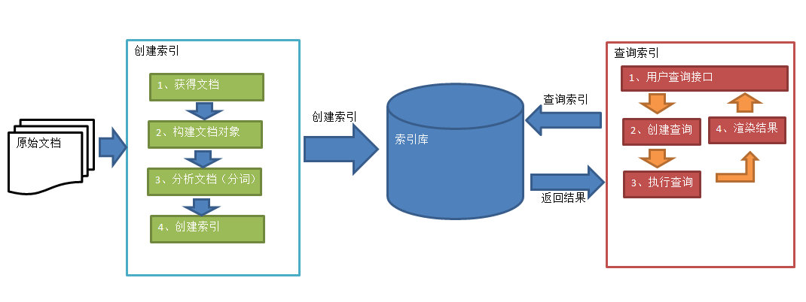

Lucene地址：

官网url：https://lucene.apache.org/core/

doc url：https://lucene.apache.org/core/8_5_1/index.html

> Apache 是完全用Java编写的高性能，功能齐全的文本搜索引擎库。Lucene并不是一个完整的应用程序，而是可以轻松地用于向应用程序添加搜索功能的代码库和API。
>
> lucene，索引与搜索流程如下：



入门程序：

> 1. pom.xml

```xml
<!-- lucene-core -->
<dependency>
    <groupId>org.apache.lucene</groupId>
    <artifactId>lucene-core</artifactId>
    <version>8.5.1</version>
</dependency>
<!-- Analyzers for indexing content in different languages and domains内容分析 -->
<dependency>
    <groupId>org.apache.lucene</groupId>
    <artifactId>lucene-analyzers-common</artifactId>
    <version>8.5.1</version>
</dependency>
<!-- Query parsers and parsing framework 查询解析器与分析框架 -->
<dependency>
    <groupId>org.apache.lucene</groupId>
    <artifactId>lucene-queryparser</artifactId>
    <version>8.5.1</version>
</dependency>
<!-- Highlights search keywords in results -->
<dependency>
    <groupId>org.apache.lucene</groupId>
    <artifactId>lucene-highlighter</artifactId>
    <version>8.5.1</version>
</dependency>
<!-- Analyzer for indexing Chinese -->
<dependency>
    <groupId>org.apache.lucene</groupId>
    <artifactId>lucene-analyzers-smartcn</artifactId>
    <version>8.5.1</version>
</dependency>
<!-- junit -->
<dependency>
    <groupId>junit</groupId>
    <artifactId>junit</artifactId>
    <version>4.13</version>
    <scope>test</scope>
</dependency>
<!-- getter/setter -->
<dependency>
    <groupId>org.projectlombok</groupId>
    <artifactId>lombok</artifactId>
    <version>1.18.12</version>
    <scope>provided</scope>
</dependency>
```

> 2. InfoEntity.java

```java
package com.dangfx.learning.lucene;

import lombok.*;

@Getter
@Setter
@ToString
public class InfoEntity {

    // 原始数据
    private String id;
    private String cateName;
    private String title;
    private String content;
    private Long price;

    // 返回结果使用
    private String hlTitle;

    public InfoEntity() {
    }

    public InfoEntity(String id, String cateName, Long price, String title, String content) {
        this.id = id;
        this.cateName = cateName;
        this.price = price;
        this.title = title;
        this.content = content;
    }
}
```

>3. IndexBuilder.java

```java
package com.dangfx.learning.lucene;

import org.apache.lucene.analysis.Analyzer;
import org.apache.lucene.analysis.cn.smart.SmartChineseAnalyzer;
import org.apache.lucene.document.*;
import org.apache.lucene.index.IndexWriter;
import org.apache.lucene.index.IndexWriterConfig;
import org.apache.lucene.index.Term;
import org.apache.lucene.store.Directory;
import org.apache.lucene.store.MMapDirectory;

import java.nio.file.Paths;
import java.util.List;

/**
 * 创建索引
 */
public class IndexBuilder {

    private IndexBuilder(){}

    // 单例-静态内部类
    private static class IndexBuilderHolder {
        private static IndexBuilder instance = new IndexBuilder();
    }
    public static IndexBuilder getInstance(){
        return IndexBuilderHolder.instance;
    }

    public int createIndex(List<InfoEntity> infoEntityList, String indexDir) throws Exception {

        IndexWriter indexWriter = init(indexDir);
        // 添加doc
        for (InfoEntity infoEntity : infoEntityList) {
            Document document = this.getDocument(infoEntity);
            indexWriter.addDocument(document);
        }
        //commit
        indexWriter.close();
        indexWriter.getDirectory().close();
        return infoEntityList.size();
    }

    public long updateIndex(InfoEntity infoEntity, String indexDir) throws Exception {
        IndexWriter indexWriter = init(indexDir);
        Document document = this.getDocument(infoEntity);
        Term term = new Term("id", infoEntity.getId());
        long result = indexWriter.updateDocument(term, document);
        indexWriter.close();
        indexWriter.getDirectory().close();
        return result;
    }

    public long deleteIndex(InfoEntity infoEntity, String indexDir) throws Exception {
        IndexWriter indexWriter = init(indexDir);
        Term term = new Term("id", infoEntity.getId());
        long result = indexWriter.deleteDocuments(term);
        indexWriter.close();
        indexWriter.getDirectory().close();
        return result;
    }

    private Document getDocument(InfoEntity infoEntity){
        Document doc = new Document();
        // id 索引,不分词,存储 -- LongPoint用于存储long类型数据，不分词
        doc.add(new StringField("id", String.valueOf(infoEntity.getId()), Field.Store.YES));
        // cateName 索引,不分词,存储 -- StringField是存储String类型的字段，不进行分词
        doc.add(new StringField("cateName", infoEntity.getCateName(), Field.Store.YES));
        // title,content 索引,分词,存储 -- TextField存入比较大的文本内容，要进行分词
        doc.add(new TextField("title", infoEntity.getTitle(), Field.Store.YES));
        doc.add(new TextField("content", infoEntity.getContent(), Field.Store.YES));
        // price 索引,支持范围查询不分词,存储
        // https://lucene.apache.org/core/8_5_1/core/org/apache/lucene/document/NumericDocValuesField.html
        // 范围查询,存储时使用哪种数据类型,范围查询时就是用杜英数据类型中范围查询方法
        //doc.add(new LongPoint("price", infoEntity.getPrice()));
        doc.add(new NumericDocValuesField("price", infoEntity.getPrice()));
        doc.add(new StoredField("price", infoEntity.getPrice()));
        return doc;
    }

    private IndexWriter init(String indexDir) throws Exception {
        // 索引存储位置
        // Directory directory = FSDirectory.open(Paths.get(indexDir));
        // 读操作是基于内存映射的方式把文件load到内存来减少与IO的交互次数，从而提高IO性能
        Directory directory = MMapDirectory.open(Paths.get(indexDir));
        // 配置分词器
        Analyzer analyzer = new SmartChineseAnalyzer();
        IndexWriterConfig conf = new IndexWriterConfig(analyzer);
        conf.setMaxBufferedDocs(10000);// 最大缓存文档数
        IndexWriter indexWriter = new IndexWriter(directory, conf);
        indexWriter.forceMerge(1000); // 设置每个段中文档数
        return indexWriter;
    }
}
```

>4. SearchBuilder.java

```java
package com.dangfx.learning.lucene;

import org.apache.lucene.analysis.Analyzer;
import org.apache.lucene.analysis.cn.smart.SmartChineseAnalyzer;
import org.apache.lucene.document.Document;
import org.apache.lucene.document.NumericDocValuesField;
import org.apache.lucene.index.DirectoryReader;
import org.apache.lucene.index.Term;
import org.apache.lucene.queryparser.classic.QueryParser;
import org.apache.lucene.search.*;
import org.apache.lucene.store.Directory;
import org.apache.lucene.store.MMapDirectory;

import java.nio.file.Paths;
import java.util.ArrayList;
import java.util.List;

/**
 * 检索
 */
public class SearchBuilder {

    private SearchBuilder(){}

    private static class SearchBuilderHolder {
        private static SearchBuilder instance = new SearchBuilder();
    }
    public static SearchBuilder getInstance(){
        return SearchBuilderHolder.instance;
    }

    public List<InfoEntity> searchIndex(String content, String indexDir) throws Exception {
        // Directory directory = FSDirectory.open(Paths.get(indexDir));
        // 读操作是基于内存映射的方式把文件load到内存来减少与IO的交互次数，从而提高IO性能
        Directory directory = MMapDirectory.open(Paths.get(indexDir));
        DirectoryReader reader = DirectoryReader.open(directory);
        IndexSearcher indexSearcher = new IndexSearcher(reader);

        // 构建查询器(查询前对条件处理完毕后,使用处理后结果作为条件查询)
        Analyzer analyzer = new SmartChineseAnalyzer();
        QueryParser parser = new QueryParser("title", analyzer);
        Query query = parser.parse("cateName:" + content);

        // 精准查询 parser ==> title 按lucene中field字段查询
        Query query1 = new TermQuery(new Term("cateName", "二手房"));

        // 价格范围查询
        String[] split = content.split("-");
        //Query query2 = LongPoint.newRangeQuery("price", Long.valueOf(split[0]), Long.valueOf(split[1]));
        Query query2 = NumericDocValuesField.newSlowRangeQuery("price", Long.valueOf(split[0]), Long.valueOf(split[1]));

        // 多条件查询 MUST ==> AND SHOULD ==> OR
        BooleanQuery.Builder builder = new BooleanQuery.Builder();
        builder.add(query1, BooleanClause.Occur.MUST);
        builder.add(query2, BooleanClause.Occur.SHOULD);

        // 执行查询
        ScoreDoc[] docs = indexSearcher.search(builder.build(), 5).scoreDocs;

        // 设置高亮
//        SimpleHTMLFormatter simpleHTMLFormatter = new SimpleHTMLFormatter("<b><font color=red>","</font></b>");
//        QueryScorer scorer = new QueryScorer(query);//计算查询结果最高的得分
//        Fragmenter fragmenter = new SimpleSpanFragmenter(scorer);//根据得分算出一个片段
//        Highlighter highlighter = new Highlighter(simpleHTMLFormatter, scorer);
//        highlighter.setTextFragmenter(fragmenter);//设置显示高亮的片段
        
        // 遍历结果
        List<InfoEntity> infoEntityList = new ArrayList<>(5);
        for (ScoreDoc scoreDoc : docs) {
            InfoEntity infoEntity = new InfoEntity();
            Document doc = indexSearcher.doc(scoreDoc.doc);
            infoEntity.setId(doc.get("id"));
            infoEntity.setCateName(doc.get("cateName"));
            infoEntity.setTitle(doc.get("title"));
            infoEntity.setContent(doc.get("content"));
            infoEntity.setPrice(doc.getField("price").numericValue().longValue());
            // 高亮
//            TokenStream tokenStream = analyzer.tokenStream("title", new StringReader(doc.get("title")));
//            String hlTitle = highlighter.getBestFragment(tokenStream, doc.get("title"));
//            infoEntity.setHlTitle(hlTitle);
            infoEntityList.add(infoEntity);
        }
        reader.close();
        directory.close();
        return infoEntityList;
    }
}
```

> 5. LuceneTest.java

```java
package com.dangfx.learning;

import com.dangfx.learning.lucene.IndexBuilder;
import com.dangfx.learning.lucene.InfoEntity;
import com.dangfx.learning.lucene.SearchBuilder;
import org.junit.Test;

import java.util.ArrayList;
import java.util.List;

public class LuceneTest {

    private static final String INDEX_DIR = "D:/lucene/lucene_data";

    @Test
    public void createIndex() throws Exception {
        IndexBuilder instance = IndexBuilder.getInstance();
        List<InfoEntity> infoEntityList = new ArrayList<>(7);
        InfoEntity info1 = new InfoEntity("41867586519590", "整租", 6500L,"禧福荷塘D区 拎包入住 包物业费 拎包住 紧邻实验小学", "禧福荷塘D区拎包入住两室两厅一卫拎包住紧邻实验小学");
        InfoEntity info2 = new InfoEntity("41701192423715", "合租", 2300L,"金融街西单商圈华远宏汇园教育部协和医院很近精装修两居室可短租", "此房位于是正规的两居室，紧邻金融街四单协和医院教育部，可短租干净整洁，无遮挡，阳光充足，格局方正，采光通风都很好，室内有床、衣柜、电视、沙发、冰箱、洗衣机、空调、热水器等基本家电家具；实用价高，居住舒适");
        InfoEntity info3 = new InfoEntity("41834735441176", "二手房", 150000L,"金源燕莎 烟树园小区精装一居室 便宜甩租", "房间选址安静宜居、出行便利，飞象长租专业设计师根据年轻人喜好打造清新舒适的现代风格。室内配套欧式床垫、抱枕、台灯、电脑桌、椅子、衣柜、挂衣钩、精美壁纸、空调、全新配置");
        InfoEntity info4 = new InfoEntity("41803787775755", "整租", 6300L,"半岛国际公寓 两卫三居 1.3万 头次出租 房子保持新", "业主是我老客户，我能帮您议价，业主特别有诚意，可以随时签约。您要是有意向随时可以安排和房主面谈。<br/>【交通配套】<br/>太阳宫周边交通网络极其发达，城铁十号线、地铁十三号线交汇，机场快轨.与北三环和城市核心形成紧密联结。");
        InfoEntity info5 = new InfoEntity("41860690769443", "整租", 1000L,"太阳宫 三元桥 芍药居 太阳星城土星园 精装2室2厅", "1.房子一直都是业主自住，全是环保材料，里面家具家电齐全，一般装修，<br/>2.位于周边公交：公交：114路、809路<br/>3.周边设施齐全：：迎春<br/>中：国际外国语、周南，：彭家巷，取款机、方便房源有效！<br/>另有周边多套房源信息与您分享！电话24开机");
        InfoEntity info6 = new InfoEntity("41845530414629", "二手房", 403000L,"真实有效房源 4居室 业主急租 看房随时 有安全护栏", "非常荣幸您光临本人的店铺，请相信您的这次点击是值得的，因为本人承诺我店铺所发房源，不浪费您的宝贵时间！<br/>推荐理由：<br/>1、此房源有效，拒绝虚假，如不，欢迎投诉<br/>2、房子本人看过的，非常了解的，图片，价格，房源<br/>3、户型：4室2厅1厨2卫1阳台，朝向：南北通透，基础设施：水,电,暖气,有线电视,宽带,电梯,车位<br/>4、正规，图片，房源，除非你不来看，来看了就肯定会喜欢的<br/>亲爱的朋友们，为了让自己不再浪费更多的时间，更多的体力，可以更快捷方便找寻到避风港！请一定相信我，相信自己的选择！期待您的来电，真诚为您服务，随时恭候您的来电！<br/>");
        InfoEntity info7 = new InfoEntity("41648906282913", "合租", 1200L,"崇文门兴隆都市馨园 户型好，价格超值，随时看房", "崇文门兴隆都市馨园1室南向，5000元/月<br/><br/>房源简介：1、！楼层！！2、落地飘窗，全天采光，环境优越，小区绿化好。3、公交：12路、25路、39路、43路、75路<br/>地铁：1号线、5号线、7号线，：东晓市<br/>中：北京第九学、第学、金鱼、崇文区金台前门<br/>：首都医科北京眼科学院，：中复电讯、新世界、国瑞城购物、搜秀商城<br/>");
        infoEntityList.add(info1);
        infoEntityList.add(info2);
        infoEntityList.add(info3);
        infoEntityList.add(info4);
        infoEntityList.add(info5);
        infoEntityList.add(info6);
        infoEntityList.add(info7);
        int num = instance.createIndex(infoEntityList, INDEX_DIR);
        System.out.println("num:" + num);
    }

    // updateIndex/deleteIndex索引时关闭luke客户端
    @Test
    public void updateIndex() throws Exception {
        IndexBuilder instance = IndexBuilder.getInstance();
        InfoEntity infoEntity = new InfoEntity("41867586519590", "合租", 6545L,"拎包入住 包物业费 拎包住 紧邻实验小学", "禧拎包入住两室两厅一卫拎包住紧邻实验小学");
        long result = instance.updateIndex(infoEntity, INDEX_DIR);
        System.out.println("result:" + result);
    }

    @Test
    public void deleteIndex() throws Exception {
        IndexBuilder instance = IndexBuilder.getInstance();
        InfoEntity infoEntity = new InfoEntity();
        infoEntity.setId("41648906282913");
        long result = instance.deleteIndex(infoEntity, INDEX_DIR);
        System.out.println("result:" + result);
    }

    @Test
    public void searchIndex() throws Exception {
        SearchBuilder instance = SearchBuilder.getInstance();
        String content = "整租";
        content = "150001-25000000";
        List<InfoEntity> infoEntityList = instance.searchIndex(content, INDEX_DIR);
        for (InfoEntity infoEntity : infoEntityList) {
            System.out.println(infoEntity);
        }
    }
}
```

luke下载：

1. lunece官网下载：https://lucene.apache.org/core/downloads.html
2. 解压后，打开文件：lucene-8.5.1\luke\luke.bat