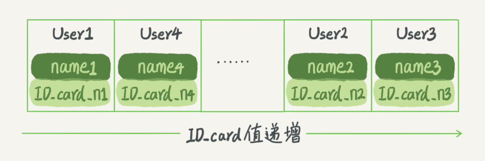
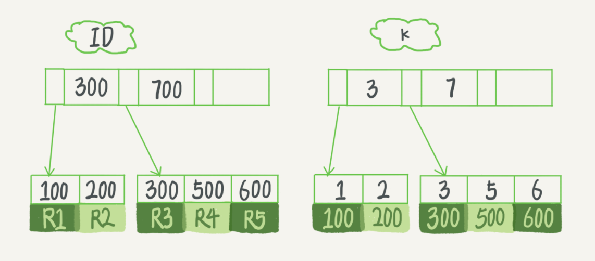
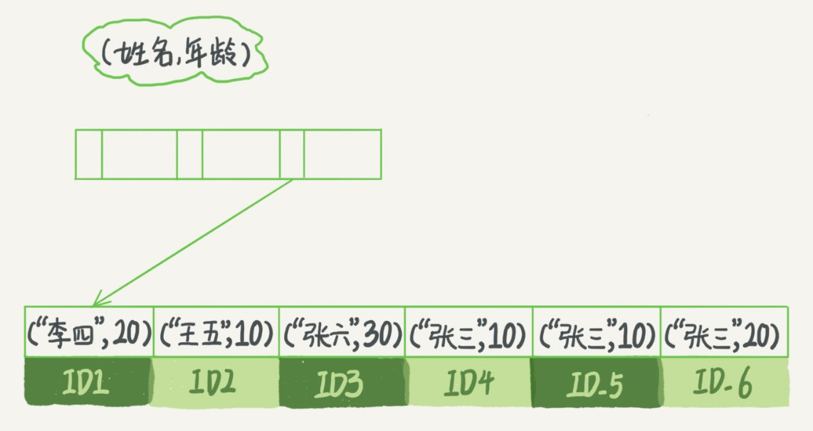
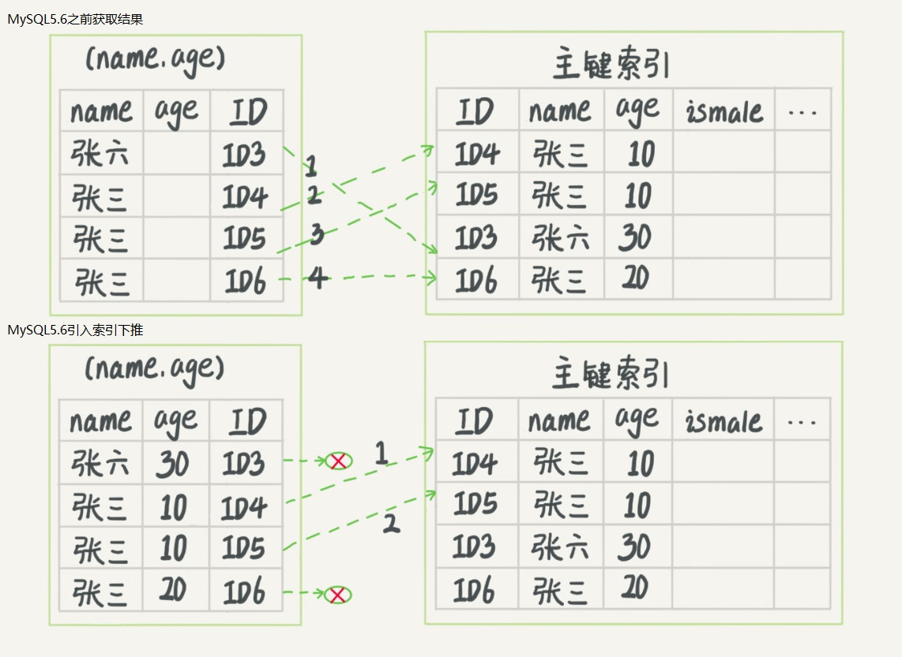
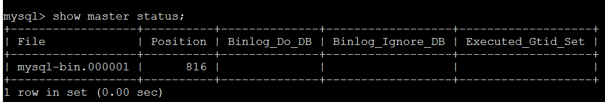

# mysql

### 1.安装Linux7.5

下载：http://vault.centos.org/7.5.1804/isos/x86_64/CentOS-7-x86_64-Minimal-1804.torrent

安装：https://blog.csdn.net/qq_24879495/article/details/77838512

### 2.安装MySQL5.7

安装方式一：https://www.cnblogs.com/hsbt2333/p/9915616.html

安装方式二：

> 下载地址：https://dev.mysql.com/downloads/file/?id=489764
>
> 参考文档：https://dev.mysql.com/doc/refman/5.7/en/
>
> 安装命令：

```powershell
# 检查 
rpm -qa | grep mariadb
rpm -qa | grep mysql
# 卸载
rpm -e --nodeps mariadb-libs-5.5.56-2.el7.x86_64
warning: /etc/my.cnf saved as /etc/my.cnf.rpmsave
rm -rf /etc/my.cnf
rm -rf /etc/my.cnf.rpmsave
# 下载
wget https://dev.mysql.com/get/Downloads/MySQL-5.7/mysql-5.7.28-1.el7.x86_64.rpm-bundle.tar
# 解压
mkdir mysql-5.7.28
tar -xvf mysql-5.7.28-1.el7.x86_64.rpm-bundle.tar -C mysql-5.7.28
# 安装依赖
yum install net-tools
# 安装mysql，注意安装步骤
rpm -ivh mysql-community-common-5.7.28-1.el7.x86_64.rpm
rpm -ivh mysql-community-libs-5.7.28-1.el7.x86_64.rpm
rpm -ivh mysql-community-client-5.7.28-1.el7.x86_64.rpm
rpm -ivh mysql-community-server-5.7.28-1.el7.x86_64.rpm
# 检查版本
mysqladmin --version
# 启动服务
systemctl start mysqld
# 检查服务状态
systemctl status mysqld
# 获取mysql自动生成密码
grep 'temporary password' /var/log/mysqld.log
2019-12-08T11:37:20.523247Z 1 [Note] A temporary password is generated for root@localhost: MpZ>A%<kv7lP
# 登录
mysql -uroot -pMpZ>A%<kv7lP
# 设置密码策略/长度
set global validate_password_policy=0;
set global validate_password_length=6;
select @@validate_password_length;
# 查看数据库
mysql> show databases;
# 授予root用户远程访问权限
grant all privileges on *.* to 'root' @'%' identified by '123456';
flush privileges;

# 安装目录说明
vim /etc/my.cnf # 全局配置文件
ls -alh /usr/bin/ | grep 'mysql' # mysql命令目录
```

>mysql 存储引擎
>
> 查看引擎 SHOW ENGINES;

| engine  | comment                                                    | other                                                    |
| ------- | ---------------------------------------------------------- | -------------------------------------------------------- |
| InnoDB  | Supports transactions, row-level locking, and foreign keys | 事物，行锁，外键，并发                                   |
| MyISAM  | MyISAM storage engine                                      |                                                          |
| CSV     | CSV storage engine                                         | 以表名开头并具有 .CSV 扩展名                             |
| ARCHIVE | Archive storage engine                                     | supports INSERT, REPLACE, SELECT, but not DELETE, UPDATE |

>sql join type


从库安装复制主库

```powershell
scp -r /usr/local/mysql root@192.168.114.132:/usr/local/mysql
```

### 3.MySQL架构

>连接器：连接管理，权限验证
>
>查询缓存：key-value，key[sql语句]，value[查询结果]
>
>分析器：词法分析(在字符串与空格中提取表名,字段名...)，语法分析(验证SQL语法正确性)
>
>优化器：完成执行过程，选择索引
>
>执行器：操作引擎，返回结果集
>
>引擎：存储数据，提供读写接口


MySQL查询语句执行过程分析：

> select * from t1 join t2 on t1.user_id = t2.user_id where t1.age = 20 and t2.num = 10;
>
> 上述SQL可能的执行过程：
>
> 1.t1表中读取age = 20的记录，根据user_id关联到t2表，判断t2表中num是否 = 10
>
> 2.t2表中读取num = 10的记录，根据user_id关联到t1表，判断t1表中age是否 = 20
>
> select * from T where ID = 10;  执行过程 ID 没有索引
>
> 1.调用引擎接口获取表的第一行，判断ID是否为10，不是跳过，是放入结果集
>
> 2.调用引擎接口获取表的下一行，判断ID是否为10，不是跳过，是放入结果集，循环至最后一行结束
>
> 3.执行器将满足条件的结果集返回给客户端

系统相关项配置

```mysql
-- 查看所有链接
show full processlist;
-- 查看系统连接超时
show variables like 'wait_timeout%';
-- 查询系统支持存储引擎
show engines;
-- 查看mysql版本
select version();
```

### 4.MySQL日志

MySQL更新语句执行过程分析：

>update user set id = id + 1 where id = 1;
>
>1.调用引擎接口获取满足条件的第一行，判断当前行的数据页是否在内存中
>
>2.如果记录在内存数据页中，返回记录给执行器，否则从磁盘将数据页加载到内存，返回给执行器
>
>3.执行器修改id，调用引擎修改接口，同时记录 redo log 更新状态为prepare，告诉执行器可以提交
>
>4.执行器写入 binlog ，调用引擎提交事务接口
>
>5.引擎将 redo log 状态修改为commit状态，更新完成
>
>(3 4 5三个状态就是二阶段提交协议)


更新语句同时维护 redo log 与 binlog，redolog 有crash-safe能力。

```mysql
-- 查看2个日志相关配置
--  binlog相关配置信息
show variables like '%log_bin%';
-- redo log 文件个数、大小
show global variables like '%innodb_log_file%';
-- InnoDB从磁盘读取数据页大小
show global variables like '%innodb_page%';
-- 每次事务的redo log都直接持久化到磁盘
show variables like '%innodb_flush_log_at_trx_commit%';
-- 每次事务的binlog都持久化到磁盘
show variables like '%sync_binlog%';
-- binlog 日志模式 
-- Statement Level 记录修改的SQL
-- Row Level       SQL+每行修改记录信息
-- Mixed           表结构变更Statement，insert/update row
show variables like '%binlog_format%';
```

> redo log 与 binlog差异
>
> 1.redo log 是物理日志，Innodb维护，大小固定，循环写入
>
> 2.binlog 是逻辑日志，MySQL服务server层维护，大小扩展，追加写入


### 5.MySQL索引

> 索引对于数据库 ==> 目录对于书，提高查询效率，索引是有引擎实现的。
>
> 常见索引模型：哈希表，有序数组，搜索树
>
> 哈希表(key-value存储)索引数据过程：
>
> 1.通过哈希函数计算key对应的数组下标
>
> 2.通过下标定位数组中对应链表数据
>
> 3.循环链表获取指定数据，返回server层
>
> 注意：哈希表存储数据无序，适合等值查询，范围查询需要扫描整个哈希表


>有序数组：适合于静态存储引擎(即历史不修改的数据)
>
>查询数据通过二分查找，时间复杂度log(N)
>
>二分查找，数据有N条，需要查询k次。
>
>第1次：N / 2， 第2次：N / 2 ^2， 第3次：N / 2^3，.... 第k次：N / 2^k
>
>最后情况获取1条数据：N / 2^k = 1，k = log2N
>
>三分查找 ：k = N / 3^k = 1，k = log3N
>
>log2N / log3N = (log10N / log102) / (log10N / log103) = log103 / log102 = ln3 / ln 2 ==> 常量
>
>查找时间复杂度与N分查找中N没有关系，故为log(N)



>搜索树
>
>查询(修改)时间复杂度：log(N)


> InnoDB引擎索引：B+树，多路搜索树，从左到右顺序存储，只有叶子节点存储数据
>
> 主键索引(聚簇索引，索引与数据存储在一起)：叶子节点存储整行数据
>
> 二级索引(非聚簇索引，索引与数据分开存储)：叶子节点存储主键ID
>
> 自增主键索引优点：1.插入数据有序，避免页分裂 2.一般占用4/8个字节，二级索引占用空间小
>
> 不使用自增索引：1.只有一个索引；2.该索引必须是唯一索引；就是KV场景。
>
> 覆盖索引：select ID from T where k between 3 and 5;
>
> k索引树可以直接提供查询结果，不需要回表，减少搜索树次数。



> 最左前缀：B+树可以利用索引的"最左前缀"。
>
> 建立联合索引事项：
>
> 1.优先通过调整顺序，减少维护索引。
>
> 2.既有联合查询，又有基于a，b各自查询，需要维护2个索引，建立单个索引使用空间较小的字段。



> 索引下推：MySQL5.6引入索引下推优化，在索引遍历中，对索引中包含的字段优先判断。
>
> 优化点：减少回表次数。



### 3.配置master-slave架构

> 1. 修改master配置：vi /etc/my.cnf

```powershell
server-id=131     	#设置serverid，这是mysql主从复制是一个很重要的标识
log-bin=mysql-bin   #启动二进制日志系统
```

> 2.授权master：

```powershell
# 重启服务
service mysql start
# 登录mysql服务
mysql -uroot -p
# 主服务器授权
grant replication slave on  *.*  to  root@'192.168.114.132' identified by 'root';
# 刷新授权
flush privileges;
# 查看状态
show master status;
# 锁表
flush table with read lock;
# 解锁
unlock table;
```



> 3.开放端口

```shell
# 开启端口
firewall-cmd --zone=public --add-port=3306/tcp --permanent
# 重载防火墙
firewall-cmd --reload
```

> 4.修改slave配置：vi /etc/my.cnf

````powershell
server-id=132     	#设置serverid，这是mysql主从复制是一个很重要的标识
````

> 5.授权slave

```powershell
# 重启服务
service mysql start
# 登录mysql服务
mysql -uroot -p
# 主服务器授权
change master to master_host='192.168.114.131', master_user='root', master_password='root', master_log_file='mysql-bin.000001', master_log_pos=816;
# 启动slave同步进程
start slave;
# 查看状态
show slave status\G;
```

### 4.配置MYCAT

注:将MYCAT安装到master服务器上

> 修改上述master数据库授权

```powershell
# 修改主服务器授权
grant replication slave on  *.*  to  root@'%' identified by 'root';
# 刷新授权
flush privileges;
# ====>防火墙相关操作<=====
# 查看防火墙状态
firewall-cmd --state
# 停止firewall
systemctl stop firewalld.service
# 禁止firewall开机启动
systemctl disable firewalld.service 
```

> 安装 JDK ==>https://blog.csdn.net/weixin_42266606/article/details/80863781

> 安装 mycli ==>https://blog.csdn.net/AnPHPer/article/details/80177105

> 安装MYCAT：==>2008年阿里的Amoeba==>2012年阿里的Cobar，依赖于java

```shell
# 下载 http://dl.mycat.io/
wget http://dl.mycat.io/1.6.5/Mycat-server-1.6.5-release-20180122220033-linux.tar.gz
# 解压
tar -zxvf Mycat-server-1.6.5-release-20180122220033-linux.tar.gz
# 移动
mv mycat /usr/local/
```

> 修改配置文件(/usr/local/mycat/conf/schema.xml)

```xml
<?xml version="1.0"?>
<!DOCTYPE mycat:schema SYSTEM "schema.dtd">
<mycat:schema xmlns:mycat="http://io.mycat/">
<schema name="TESTDB" checkSQLschema="false" sqlMaxLimit="100" dataNode="dn1"></schema>
    <!--
		name="dn1"对应 schema中dataNode="dn1"
		dataHost="node01"对应 <dataHost name="node01"
		database="my_test" 代表<dataHost中配置真是IP的数据库实例
	-->
    <dataNode name="dn1" dataHost="node01" database="my_test" />
    <!--指定mastet的ip -->
    <dataHost name="node01" maxCon="1000" minCon="10" balance="1"
            writeType="0" dbType="mysql" dbDriver="native" switchType="1" slaveThreshold="100">
            <!--表示mysql的心跳状态-->
            <heartbeat>select user()</heartbeat>
            <!-- master负责写 -->
            <writeHost host="192.168.114.131" url="192.168.114.131:3306" user="root" password="root">
                    <!--slave负责读-->
                    <readHost host="192.168.114.132" url="192.168.114.132:3306" user="root" password="root" />
            </writeHost>
        <!--
            <writeHost host="192.168.114.132" url="192.168.114.132:3306" user="root" password="root" />
        -->
        </dataHost>
</mycat:schema>
```

> 修改配置文件(/usr/local/mycat/conf/server.xml)

```xml
<?xml version="1.0" encoding="UTF-8"?>
<!DOCTYPE mycat:server SYSTEM "server.dtd">
<mycat:server xmlns:mycat="http://io.mycat/">
<system>
<!-- 0为需要密码登陆、1为不需要密码登陆 ,默认为0，设置为1则需要指定默认账户-->
<property name="nonePasswordLogin">0</property> 
<property name="useHandshakeV10">1</property>
<!-- 1为开启实时统计、0为关闭 -->
<property name="useSqlStat">0</property>
<!-- 1为开启全加班一致性检测、0为关闭 -->
<property name="useGlobleTableCheck">0</property>  
<property name="sequnceHandlerType">2</property>
<!-- 子查询中存在关联查询的情况下,检查关联字段中是否有分片字段 .默认 false -->
<property name="subqueryRelationshipCheck">false</property> 
<!--默认为type 0:DirectByteBufferPool | type 1 ByteBufferArena | type 2 NettyBufferPool-->
<property name="processorBufferPoolType">0</property>
<property name="serverPort">8066</property>
<property name="managerPort">9066</property>
<!--分布式事务开关，0为不过滤分布式事务，1为过滤分布式事务（如果分布式事务内只涉及全局表，则不过滤），2为不过滤分布式事务,但是记录分布式事务日志-->
<property name="handleDistributedTransactions">0</property>
<property name="useOffHeapForMerge">1</property>
<!--单位为m-->
<property name="memoryPageSize">64k</property>
<!--单位为k-->
<property name="spillsFileBufferSize">1k</property>
<property name="useStreamOutput">0</property>
<!--单位为m-->
<property name="systemReserveMemorySize">384m</property>
<!--是否采用zookeeper协调切换  -->
<property name="useZKSwitch">false</property>
</system>

<user name="root" defaultAccount="true">
        <property name="password">123456</property>
        <property name="schemas">TESTDB</property>
</user>

<user name="my_test">
        <property name="password">123456</property>
        <property name="schemas">TESTDB</property>
        <property name="readOnly">true</property>
</user>
</mycat:server>
```

> MYCAT 后续

```powershell
# 启动MYCAT
cd /usr/local/mycat/bin
# 启动
./mycat start
# 重启
./mycat restart
# 停止
./mycat stop
# 查看日志
tail -f /usr/local/mycat/logs/mycat.log

#登录MYCAT（数据库中间层）
mycli -uroot -h127.0.0.1 -P8066 -p123456
# 登录MYCAT管理
mysql -uroot -h127.0.0.1 -P9066 -p123456 
```


mysql忘记密码：https://blog.csdn.net/qq_38130747/article/details/85217658

```powershell
# 核心修改sql
update mysql.user set authentication_string=PASSWORD('root'), plugin='mysql_native_password' where user='root';
```

