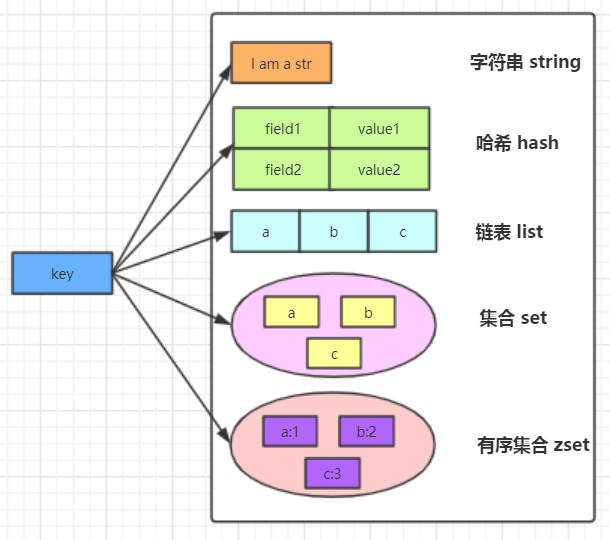

## 一.redis基础

定义：C语言编写，单线程模型，支持多种数据类型，可持久化的内存DB；

`linux` 源码安装：

```powershell
# 1.download
cd /root/softwore/
wget http://download.redis.io/releases/redis-5.0.5.tar.gz
# 2.解压
tar -zxvf redis-5.0.5.tar.gz -C /opt/software/
cd /opt/software/redis-5.0.5/src/
# 安装gcc
yum install gcc-c++
# 编译安装redis，如果不指定 PREFIX， 默认redis安装路径[/usr/local/bin/]
make
make install PREFIX=/usr/local/redis
```

redis命令使用：

1.命令行查看

```powershell
# 启动[默认前台启动]
/usr/local/bin/redis-server /home/redis-5.0.5/redis.conf
ps -ef | grep redis
# 登录
/usr/local/bin/redis-cli
# 查看帮助
help
To get help about Redis commands type:
      "help @<group>" to get a list of commands in <group>
      "help <command>" for help on <command>
      "help <tab>" to get a list of possible help topics
      "quit" to exit
```

2.[redis命令参考](http://redisdoc.com/)

数据类型：



| 序号 | 数据类型 | 类比                    | 特点                 |
| :--- | -------- | ----------------------- | -------------------- |
| 1    | string   | String k                | 512M                 |
| 2    | list     | List<String> list       | 有序重复(双向链表)   |
| 3    | set      | Set<String> set         | 无序不重复           |
| 4    | hash     | Map<String, String> map | KV映射表             |
| 5    | zset     | Map<String, Double> map | 成员不重复分数可重复 |

redis持久化：

>1.RDB[redis database]
>
>触发添加：
>
>1. after 900 sec (15 min) if at least 1 key changed
>   after 300 sec (5 min) if at least 10 keys changed
>   after 60 sec if at least 10000 keys changed
>2. 手动 `save` (阻塞)，手动 `bgsave` (非阻塞) 
>3. 手动 `shutdown`

```powershell
# redis 默认开启 rdb， redis.conf 配置如下
# 持久化策略
save 900 1
save 300 10
save 60 10000
# 开启rdb压缩
rdbcompression yes
# 指定rdb文件
dbfilename dump.rdb
# 指定目录
dir ./

# 观察redis日志观察原理
1165:M 13 Sep 2019 13:13:51.871 * 100 changes in 300 seconds. Saving...
1165:M 13 Sep 2019 13:13:51.896 * Background saving started by pid 1236
1236:C 13 Sep 2019 13:13:51.899 * DB saved on disk
1236:C 13 Sep 2019 13:13:51.900 * RDB: 4 MB of memory used by copy-on-write
1165:M 13 Sep 2019 13:13:51.996 * Background saving terminated with success
```

>2.AOF[append of file]

```powershell
# 开启aof
appendonly yes
# 指定aof文件
appendfilename "appendonly.aof"
# 指定aof策略
# appendfsync always 每条记录一次
appendfsync everysec # 每秒一次
# appendfsync no	 OS决定
# aof文件重写机制()
auto-aof-rewrite-percentage 100
auto-aof-rewrite-min-size 64mb
# 启动redis，观察日志
1340:M 13 Sep 2019 13:47:07.052 * DB loaded from append only file: 0.028 seconds
1340:M 13 Sep 2019 13:47:07.052 * Ready to accept connections

# shudown redis，观察日志
1340:M 13 Sep 2019 13:48:11.561 # User requested shutdown...
1340:M 13 Sep 2019 13:48:11.561 * Calling fsync() on the AOF file.
1340:M 13 Sep 2019 13:48:11.561 * Saving the final RDB snapshot before exiting.
1340:M 13 Sep 2019 13:48:11.564 * DB saved on disk
1340:M 13 Sep 2019 13:48:11.564 * Removing the pid file.
1340:M 13 Sep 2019 13:48:11.564 # Redis is now ready to exit, bye bye...
```

## 二.读写分离/哨兵/集群

>1.redis读写分离 (一主二从)

```powershell
# 创建 redis 配置文件
cd /home/redis-5.0.5
touch redis6379.conf
# 6379 ==================>
include /home/redis-5.0.5/redis.conf
daemonize yes
port 6379
pidfile /var/run/redis_6379.pid
dbfilename dump_6379.rdb
appendonly yes
appendfilename "appendonly_6379.aof"

# copy file 6380
cp redis6379.conf redis6380.conf
# 6380 ==================>
include /home/redis-5.0.5/redis.conf
daemonize yes
port 6380
pidfile /var/run/redis_6380.pid
dbfilename dump_6380.rdb
appendonly yes
appendfilename "appendonly_6380.aof"
slaveof 127.0.0.1 6379 # 配置主从关系

# copy file 6381
cp redis6379.conf redis6381.conf
# 6381 ==================>
include /home/redis-5.0.5/redis.conf
daemonize yes
port 6381
pidfile /var/run/redis_6381.pid
dbfilename dump_6381.rdb
appendonly yes
appendfilename "appendonly_6381.aof"
slaveof 127.0.0.1 6379 # 配置主从关系

# 启动 redis
/usr/local/bin/redis-server /home/redis-5.0.5/redis6379.conf
/usr/local/bin/redis-server /home/redis-5.0.5/redis6380.conf
/usr/local/bin/redis-server /home/redis-5.0.5/redis6381.conf

# 查看 master info
[root@localhost bin]# redis-cli -h 127.0.0.1 -p 6379
127.0.0.1:6379> info replication
# Replication
role:master
connected_slaves:2
slave0:ip=127.0.0.1,port=6380,state=online,offset=112,lag=1
slave1:ip=127.0.0.1,port=6381,state=online,offset=112,lag=1
master_replid:35a926bff993393e62d062f1bb6b65ec08dd1f8f
master_replid2:0000000000000000000000000000000000000000
master_repl_offset:112
second_repl_offset:-1
repl_backlog_active:1
repl_backlog_size:1048576
repl_backlog_first_byte_offset:1
repl_backlog_histlen:112

# 查看 slave info
[root@localhost bin]# redis-cli -h 127.0.0.1 -p 6380
127.0.0.1:6380> info replication
# Replication
role:slave
master_host:127.0.0.1
master_port:6379
master_link_status:up
master_last_io_seconds_ago:4
master_sync_in_progress:0
slave_repl_offset:210
slave_priority:100
slave_read_only:1
connected_slaves:0
master_replid:35a926bff993393e62d062f1bb6b65ec08dd1f8f
master_replid2:0000000000000000000000000000000000000000
master_repl_offset:210
second_repl_offset:-1
repl_backlog_active:1
repl_backlog_size:1048576
repl_backlog_first_byte_offset:1
repl_backlog_histlen:210

# 说明，slave节点只能get，不能set
[root@localhost bin]# redis-cli -h 127.0.0.1 -p 6379
127.0.0.1:6379> set k1 v1
OK
127.0.0.1:6379> get k1
"v1"
127.0.0.1:6379> quit
[root@localhost bin]# redis-cli -h 127.0.0.1 -p 6380
127.0.0.1:6380> get k1
"v1"
127.0.0.1:6380> set k2 v2
(error) READONLY You can't write against a read only replica.

```

>2.redis哨兵(要在主从的基础上配置)
>
>作用:master节点宕掉以后，slave节点自动转换为master节点

```powershell
# 创建配置文件
touch sentinel.conf
vim sentinel.conf
# =======================>
daemonize yes
sentinel monitor mymaster 127.0.0.1 6379 1

# 启动主从节点配后，启动哨兵
/usr/local/bin/redis-sentinel /home/redis-5.0.5/sentinel.conf

# 查看 sentinel info
[root@localhost bin]# redis-cli -h 127.0.0.1 -p 26379
127.0.0.1:26379> info
# Sentinel
sentinel_masters:1
sentinel_tilt:0
sentinel_running_scripts:0
sentinel_scripts_queue_length:0
sentinel_simulate_failure_flags:0
master0:name=mymaster,status=ok,address=127.0.0.1:6379,slaves=2,sentinels=1

# ====> shutdown master 观察日志如下:
# +sdown master mymaster 127.0.0.1 6379
# +odown master mymaster 127.0.0.1 6379 #quorum 1/1
# +new-epoch 3
# +try-failover master mymaster 127.0.0.1 6379
# +vote-for-leader 908ba6f1c0398839abd3410e818833928c58d6ae 3
# +elected-leader master mymaster 127.0.0.1 6379
# +failover-state-select-slave master mymaster 127.0.0.1 6379
# +selected-slave slave 127.0.0.1:6380 127.0.0.1 6380 @ mymaster 127.0.0.1 6379
* +failover-state-send-slaveof-noone slave 127.0.0.1:6380 127.0.0.1 6380 @ mymaster 127.0.0.1 6379
* +failover-state-wait-promotion slave 127.0.0.1:6380 127.0.0.1 6380 @ mymaster 127.0.0.1 6379
# +promoted-slave slave 127.0.0.1:6380 127.0.0.1 6380 @ mymaster 127.0.0.1 6379
# +failover-state-reconf-slaves master mymaster 127.0.0.1 6379
* +slave-reconf-sent slave 127.0.0.1:6381 127.0.0.1 6381 @ mymaster 127.0.0.1 6379
* +slave-reconf-inprog slave 127.0.0.1:6381 127.0.0.1 6381 @ mymaster 127.0.0.1 6379
* +slave-reconf-done slave 127.0.0.1:6381 127.0.0.1 6381 @ mymaster 127.0.0.1 6379
# +failover-end master mymaster 127.0.0.1 6379
# +switch-master mymaster 127.0.0.1 6379 127.0.0.1 6380
* +slave slave 127.0.0.1:6381 127.0.0.1 6381 @ mymaster 127.0.0.1 6380
* +slave slave 127.0.0.1:6379 127.0.0.1 6379 @ mymaster 127.0.0.1 6380
```

> 3.redis集群，redis5.0以上版本不需要安装ruby

```powershell
####### 搭建3主3从集群 #######
# 举例6379，其余类似，只需替换6379即可
touch redis6379.conf
# 6379===================>
include /home/redis-5.0.5/redis.conf
daemonize yes
port 6379
pidfile /var/run/redis_6379.pid
dbfilename dump_6379.rdb
appendonly yes
appendfilename "appendonly_6379.aof"
cluster-enabled yes
cluster-node-timeout 5000
protected-mode no
cluster-config-file nodes.conf

# 启动 all redis
/usr/local/bin/redis-server /home/redis-5.0.5/master/redis6379.conf

# 创建集群
[root@localhost master]# /usr/local/bin/redis-cli --cluster create 127.0.0.1:6379 127.0.0.1:6380 127.0.0.1:6381 127.0.0.1:6389 127.0.0.1:6390 127.0.0.1:6391 --cluster-replicas 1
>>> Performing hash slots allocation on 6 nodes...
Master[0] -> Slots 0 - 5460
Master[1] -> Slots 5461 - 10922
Master[2] -> Slots 10923 - 16383
Adding replica 127.0.0.1:6390 to 127.0.0.1:6379
Adding replica 127.0.0.1:6391 to 127.0.0.1:6380
Adding replica 127.0.0.1:6389 to 127.0.0.1:6381
>>> Trying to optimize slaves allocation for anti-affinity
[WARNING] Some slaves are in the same host as their master
M: 8f66ee7bd4d1ca426c0e2b7b77fe4a33a541b480 127.0.0.1:6379
   slots:[0-5460] (5461 slots) master
M: f963cf970b36d26de84c2d76c3a71ba261822b90 127.0.0.1:6380
   slots:[5461-10922] (5462 slots) master
M: 1a7dbdce3fbbd9f9a09105b9d76fa0f0d039831c 127.0.0.1:6381
   slots:[10923-16383] (5461 slots) master
S: aef09f2e7ae1684204339f78901f37ea21c25867 127.0.0.1:6389
   replicates 1a7dbdce3fbbd9f9a09105b9d76fa0f0d039831c
S: 67c6403d3f6d879a626b2946da0d4556b0956728 127.0.0.1:6390
   replicates 8f66ee7bd4d1ca426c0e2b7b77fe4a33a541b480
S: 46a83385587cabf7463e621eb36b788a0d8b79d9 127.0.0.1:6391
   replicates f963cf970b36d26de84c2d76c3a71ba261822b90
Can I set the above configuration? (type 'yes' to accept): yes
>>> Nodes configuration updated
>>> Assign a different config epoch to each node
>>> Sending CLUSTER MEET messages to join the cluster
Waiting for the cluster to join
...
>>> Performing Cluster Check (using node 127.0.0.1:6379)
M: 8f66ee7bd4d1ca426c0e2b7b77fe4a33a541b480 127.0.0.1:6379
   slots:[0-5460] (5461 slots) master
   1 additional replica(s)
S: aef09f2e7ae1684204339f78901f37ea21c25867 127.0.0.1:6389
   slots: (0 slots) slave
   replicates 1a7dbdce3fbbd9f9a09105b9d76fa0f0d039831c
S: 46a83385587cabf7463e621eb36b788a0d8b79d9 127.0.0.1:6391
   slots: (0 slots) slave
   replicates f963cf970b36d26de84c2d76c3a71ba261822b90
M: f963cf970b36d26de84c2d76c3a71ba261822b90 127.0.0.1:6380
   slots:[5461-10922] (5462 slots) master
   1 additional replica(s)
M: 1a7dbdce3fbbd9f9a09105b9d76fa0f0d039831c 127.0.0.1:6381
   slots:[10923-16383] (5461 slots) master
   1 additional replica(s)
S: 67c6403d3f6d879a626b2946da0d4556b0956728 127.0.0.1:6390
   slots: (0 slots) slave
   replicates 8f66ee7bd4d1ca426c0e2b7b77fe4a33a541b480
[OK] All nodes agree about slots configuration.
>>> Check for open slots...
>>> Check slots coverage...
[OK] All 16384 slots covered.

# test
[root@localhost bin]# redis-cli -c -h 127.0.0.1 -p 6379
127.0.0.1:6379> set k1 v1
-> Redirected to slot [12706] located at 127.0.0.1:6381
OK
127.0.0.1:6381> set k2 v2
-> Redirected to slot [449] located at 127.0.0.1:6379
OK
127.0.0.1:6379> mset k3{c} v3 k4{c} v4
-> Redirected to slot [7365] located at 127.0.0.1:6380
OK
```


## 三.redis实战应用

